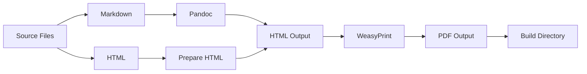

# Build Guide - Eda TTRPG

This guide explains how to build the Eda TTRPG PDFs from the source Markdown and HTML files.

---

## Table of Contents

1. [Prerequisites](#prerequisites)
2. [Virtual Environment Setup](#virtual-environment-setup)
3. [Installing Dependencies](#installing-dependencies)
4. [Building PDFs](#building-pdfs)
5. [Character Sheet Generation](#character-sheet-generation)
6. [Troubleshooting](#troubleshooting)
7. [Development Workflow](#development-workflow)

---

## Prerequisites

### Required Software

- **Python 3.10 or higher**
  - Download from [python.org](https://www.python.org/downloads/)
  - Verify installation: `python --version` or `python3 --version`

- **Pandoc** (Universal document converter)
  - **macOS**: `brew install pandoc`
  - **Linux**: `sudo apt-get install pandoc` (Debian/Ubuntu) or `sudo dnf install pandoc` (Fedora)
  - **Windows**: Download installer from [pandoc.org](https://pandoc.org/installing.html)
  - Verify installation: `pandoc --version`

- **WeasyPrint** (HTML to PDF converter)
  - Installed via pip: `pip install weasyprint`
  - See [Installing Dependencies](#installing-dependencies) for details

---

## Virtual Environment Setup

**Important:** Always use a virtual environment to manage project dependencies. The build script will check if you're running in a virtual environment and warn you if not.

### Creating a Virtual Environment

```bash
# Navigate to project directory
cd /path/to/eda

# Create virtual environment
python3 -m venv venv

# Activate virtual environment
# On macOS/Linux:
source venv/bin/activate

# On Windows:
venv\Scripts\activate
```

### Deactivating the Virtual Environment

```bash
deactivate
```

---

## Installing Dependencies

### 1. Install WeasyPrint

WeasyPrint requires system-level dependencies for rendering PDFs correctly.

#### macOS

```bash
# Install WeasyPrint
pip install weasyprint

# If you encounter errors, install system dependencies via Homebrew:
brew install cairo pango gdk-pixbuf libffi
```

#### Linux (Debian/Ubuntu)

```bash
# Install system dependencies
sudo apt-get update
sudo apt-get install python3-dev python3-pip python3-cffi python3-brotli libpango-1.0-0 libharfbuzz0b libpangoft2-1.0-0

# Install WeasyPrint
pip install weasyprint
```

#### Linux (Fedora/RHEL)

```bash
# Install system dependencies
sudo dnf install python3-devel redhat-rpm-config gcc libffi-devel pango-devel gdk-pixbuf2-devel

# Install WeasyPrint
pip install weasyprint
```

#### Windows

```bash
# Install WeasyPrint
pip install weasyprint

# WeasyPrint on Windows requires GTK3 libraries
# Download and install from: https://github.com/tschoonj/GTK-for-Windows-Runtime-Environment-Installer
```

### 2. Verify Dependencies

```bash
# Check Python version (must be 3.10+)
python --version

# Check Pandoc
pandoc --version

# Check WeasyPrint
python -c "import weasyprint; print(weasyprint.__version__)"

# Or use the build script's check command:
python scripts/build.py --check
```

---

## Building PDFs

### Build All PDFs

To build all PDFs at once:

```bash
# Ensure virtual environment is activated
source venv/bin/activate

# Build all PDFs
python scripts/build.py
```

**Note:** The build script will check if you're running in a virtual environment and warn you if not activated.

This will generate the following PDFs in the `build/` directory:
- `Core_Rulebook.pdf`
- `Creature_Compendium.pdf`
- `Cheat_Sheet.pdf`
- `Adventure_The_Age_of_Wolves.pdf`
- `World_of_Eda.pdf`
- `Character_Sheet.pdf`

### Build Specific File

To build a single file:

```bash
# By source filename
python scripts/build.py "Core Rulebook.md"

# By PDF name
python scripts/build.py "Core_Rulebook.pdf"
```

### Build Options

```bash
# Check dependencies without building
python scripts/build.py --check

# View help
python scripts/build.py --help
```

---

## Character Sheet Generation

The character sheet generation process is handled automatically by the build script, but here are the details:

### Process Flow

1. **Source**: `character_sheet.html` - HTML template with placeholder fields
2. **Prepare**: `scripts/prepare_html.py` - Converts placeholders to form inputs
3. **Generate**: `scripts/generate_interactive_sheet.py` - Adds interactive PDF fields
4. **Output**: `build/Character_Sheet.pdf` - Fillable PDF character sheet

### Manual Character Sheet Generation

If you need to generate the character sheet separately:

```bash
# Step 1: Prepare interactive HTML
python scripts/prepare_html.py

# Step 2: Generate interactive PDF
python scripts/generate_interactive_sheet.py

# Step 3: Convert to final PDF
python -m weasyprint character_sheet_interactive.html build/Character_Sheet.pdf
```

### Character Sheet Coordinate System

The `coordinates.json` file contains the positions of form fields in the character sheet. If you modify the HTML layout, you may need to update these coordinates.

---

## Troubleshooting

### Common Issues

#### "Pandoc not found"

**Problem:** The build script cannot find Pandoc.

**Solution:**
1. Verify Pandoc is installed: `pandoc --version`
2. If not installed, follow instructions in [Prerequisites](#prerequisites)
3. If installed but not found, add Pandoc to your system PATH

#### "WeasyPrint not found"

**Problem:** The build script cannot find WeasyPrint.

**Solution:**
1. Verify WeasyPrint is installed: `python -c "import weasyprint"`
2. If not installed: `pip install weasyprint`
3. If installed but not found, ensure you're using the correct Python environment

#### "ModuleNotFoundError: No module named 'cairo'"

**Problem:** Missing system dependencies for WeasyPrint.

**Solution:** Install system-level dependencies for your OS (see [Installing Dependencies](#installing-dependencies))

#### "Permission denied" when running build script

**Problem:** Script doesn't have execute permissions.

**Solution:**
```bash
chmod +x scripts/build.py
```

#### "character_sheet.html not found"

**Problem:** Character sheet source file is missing.

**Solution:**
1. Verify `character_sheet.html` exists in the project root
2. If missing, check if it was accidentally deleted or moved

#### PDFs have incorrect formatting

**Problem:** Generated PDFs don't look right.

**Solution:**
1. Check that `scripts/style.css` exists
2. Verify Pandoc version: `pandoc --version`
3. Try rebuilding after clearing the `build/` directory:
   ```bash
   rm -rf build/
   python scripts/build.py
   ```

#### Build takes too long

**Problem:** Building all PDFs is slow.

**Solution:**
1. Build only the files you're working on: `python scripts/build.py "Core Rulebook.md"`
2. Ensure you're not running other resource-intensive processes
3. Check if Pandoc is using all available CPU cores

### Getting Help

If you encounter an issue not listed here:

1. Check the build script output for error messages
2. Verify all dependencies are installed correctly
3. Try running with `--check` flag to diagnose issues
4. Open an issue on GitHub with:
   - Your operating system
   - Python version: `python --version`
   - Pandoc version: `pandoc --version`
   - WeasyPrint version: `python -c "import weasyprint; print(weasyprint.__version__)"`
   - Full error message

---

## Development Workflow

### Making Changes to Content

1. **Edit Source Files**: Make changes to `.md` or `.html` files
2. **Build PDFs**: Run `python scripts/build.py` or build specific files
3. **Review Output**: Check the generated PDFs in `build/`
4. **Iterate**: Repeat as needed

### Recommended Workflow for Active Development

```bash
# 1. Activate virtual environment
source venv/bin/activate

# 2. Make changes to source files
# (Use your preferred editor)

# 3. Build only the file you're working on
python scripts/build.py "Core Rulebook.md"

# 4. View the generated PDF
open build/Core_Rulebook.pdf  # macOS
xdg-open build/Core_Rulebook.pdf  # Linux
start build/Core_Rulebook.pdf  # Windows

# 5. Repeat steps 2-4 as needed
```

### Building for Production

When preparing for a release:

```bash
# 1. Clean build directory
rm -rf build/

# 2. Build all PDFs
python scripts/build.py

# 3. Verify all PDFs were generated
ls -lh build/

# 4. Test opening each PDF to ensure they render correctly
```

---

## Advanced Topics

### Custom CSS Styling

The project uses `scripts/style.css` for PDF styling. To customize:

1. Edit `scripts/style.css`
2. Rebuild PDFs: `python scripts/build.py`

### Adding New Documents

To add a new document to the build process:

1. Create the source file (`.md` or `.html`)
2. Add it to the `FILES_TO_CONVERT` dictionary in `scripts/build.py`:
   ```python
   FILES_TO_CONVERT = {
       # ... existing files ...
       'New_Document.md': ('New_Document.pdf', 'Document Title', True),
   }
   ```
3. Rebuild: `python scripts/build.py`

### Modifying the Build Process

The build script is modular and can be extended:

- `convert_md_to_html()`: Handles Markdown to HTML conversion
- `convert_html_to_pdf()`: Handles HTML to PDF conversion
- `prepare_character_sheet()`: Handles character sheet preparation

See the script source code for details.

---

## Performance Tips

- **Build Only What You Need**: Use specific file builds during development
- **Use SSD Storage**: Build times are significantly faster on SSDs
- **Close Other Applications**: Free up system resources during builds
- **Keep Dependencies Updated**: Regularly update Pandoc and WeasyPrint

---

## Build System Architecture



---

## Additional Resources

- [Pandoc Documentation](https://pandoc.org/MANUAL.html)
- [WeasyPrint Documentation](https://doc.courtbouillon.org/weasyprint/)
- [Python Virtual Environments](https://docs.python.org/3/library/venv.html)

---

## Changelog

### v1.0.0 (2024-02-12)
- Consolidated build scripts into single `build.py`
- Added dependency checking
- Improved error handling and logging
- Added support for building specific files
- Added `--check` flag for dependency verification
