# Eda
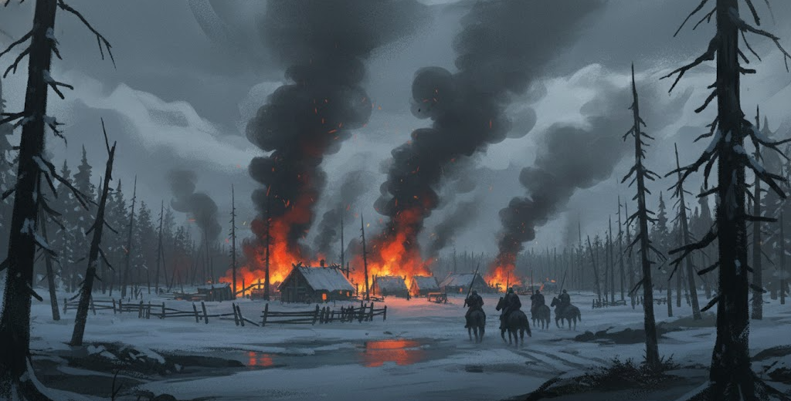

## Introduction

Eda is a dark fantasy roleplaying game of magic, wonder, and perilous adventure. While the world is filled with supernatural forces, magic often carries heavy consequences for those who dare to wield it.

Life in Eda is harsh and often short. It was not always so; legends speak of a prosperous land where peace and harmony once reigned. The name Eda itself is said to mean "Wondrous" in a long-forgotten tongue. Today, few believe these old stories, and they are whispered only in the safety of dimly lit taverns or behind locked doors.

Common people are scared not only of darkness, monsters, and other creatures roaming the countryside but also of religious fanatics, powerful clans, and corrupt governments. Rulers are often bandits, scoundrels, and men trying to prey on the weak. Then there are diseases, harsh weather, and pests eating the crops. Life is not easy for those trying to do good.

> Winter had arrived, snowflakes gently falling down to the ground. Jonah had finished helping his father put the horses in the stable. It was still not too cold, a wool sweater was enough to hold the cold at bay for now. A river passed by the back side of the house. Jonah walked to get water for dinner. Fog covered the water this morning, reaching out and massaging the grass on each side like fingers playing a beautiful tune on the lute. He bent down to fill up his bucket, something dark suddenly reached out and Jonah was never seen again.

## What is a Roleplaying Game?

A tabletop role-playing game is played with a group of friends. One acts as a game master (GM). The rest will take control of a player character (PC). The players act through their character and let their character make decisions. The GM will be the world around the players and guide them. Together the players and the GM create a collaborative adventure.

The primary goal is that everyone should have fun. The rules laid out in this book are for guidance, your group might feel like changing some aspects on how you feel to play the game and that is great! Homebrewing of the rules are encouraged. 

The game is divided into Adventures and Campaigns.

*   **Adventure**: A short story or quest.
*   **Campaign**: A series of adventures connected together by a continuing storyline.

## Dice Mechanics

Dice are used to decide outcomes of uncertain actions. Eda uses two 10-sided dice to represent numbers from 01-100, referred to as a d100.

*   **Primary Dice**: Represents the 10s (00, 10, 20... 90).
*   **Secondary Dice**: Represents the 1s (0-9).

> ### Example: Rolling the Dice
>
> A "70" on the primary and "5" on the secondary equals 75.
>
> Two "0"s equal 100.
>
> Note on Rounding: When dividing values (e.g., Skill / 2), always round down. Example: 75 / 2 = 37.

## Game Sessions

While the duration of play is up to each group, sessions typically last 4–5 hours. This allows enough time for the story to unfold without causing player fatigue. Ultimately, you should choose a pace that ensures the most enjoyment for your group.

**Session 0**: It is always a good idea to have a first session where you don’t adventure fully but make sure everyone has a character created, backstories are done, and expectations are set regarding the tone of the game.

## Core Mechanics

### Checks

When a character attempts an action with an uncertain outcome, the game master (GM) will call for a check. To make a check, roll a d100 (two ten-sided dice).

*   **Success**: Roll under or equal to your skill or attribute value.
*   **Failure**: Roll over your skill or attribute value.

Success is not only if you succeeded in something or not. Eda uses degree of sucess to see how good you performed something. Failure might also have different consquences but is decided by the GM only and not measured by dice. A failure is a failure.

### Degree of Success (DoS)

Eda uses a "blackjack" style system where you want to roll as high as possible without exceeding your skill value. The quality of your success is measured by the degree of success (DoS).

*   Calculating DoS: Your DoS is equal to the tens digit of your successful roll.
    *   *Example*: A roll of 48 provides 4 DoS.

> ### Example: Calculating DoS
>
> Bjorn (Skill 70) attempts to track a wolf.
>
> *   He rolls a 65: Success! The tens digit is 6, so he achieves 6 DoS.
> *   He rolls a 12: Success! The tens digit is 1, so he achieves 1 DoS.
> *   He rolls a 75: Failure! He achieves 0 DoS.

### Critical Success

*   **Critical Success**: A pair (11, 22, 33...) that is under or equal to your skill value.
    *   **Combat**: Deals critical damage (weapon damage + tens digit of the skill) AND inflicts a **Wound** (see Damage & Health section).
    *   **Non-Combat**: Automatically fulfills the required degrees of success for any difficulty level.

### Difficulty Modifiers

Some tasks are harder than others and the GM might require a minimum number of degrees of success to succeed.

> ### Example: Bjorn swimming in the river
>
> Bjorn ended up in the river with his chainmail and a strong current,
> while he can swim he is struggling to reach the shore.
>
> *   He rolls a 65: Success! The tens digit is 6, so he achieves 6 DoS. The GM had decided 2 DoS would be enough in this case.

| Difficulty          | Requirement | Description                                     |
| :------------------ | :---------- | :---------------------------------------------- |
| **Easy**            | 0 DoS       | Routine tasks with no significant pressure.     |
| **Routine**         | 1 DoS       | Standard professional tasks.                    |
| **Challenge**       | 2 DoS       | Demanding tasks requiring focus and skill.      |
| **Hard**            | 4 DoS       | Significant obstacles; requires expertise.      |
| **Extreme**         | 6 DoS       | At the edge of human capability.                |
| **Near Impossible** | 8 DoS       | Practically legendary feats; requires a Master. |

### Advantage & Disadvantage

When you have advantage or disadvantage, you roll d100 as normal, but you can swap which die is the primary (tens) and which is the secondary (units). This allows you to choose between two possible results from a single roll.

*   **Advantage**: You select the best result. The best result is defined as the successful roll that provides the highest degree of success (DoS).
*   **Disadvantage**: You must take the worst result.

> ### Example: Advantage Swap
>
> Bjorn (Skill 70) rolls with advantage. He rolls a 2 and a 6.
>
> *   Option A: 26 (2 DoS)
> *   Option B: 62 (6 DoS)
>
> Bjorn picks 62. It is still under his skill (70), but it provides a higher DoS.

### Opposing Rolls

When two characters compete (e.g., an arm wrestling match or hiding from a guard), both make a check.

*   **Highest Successful Roll Wins**: If both succeed, the character with the highest successful roll wins (degree of success).
*   **Single Success**: If one succeeds and the other fails, the successful character wins.
*   **Double Failure**: If both fail, the situation remains unchanged.

### Pushing the Limit

Before rolling, a player can declare they are "Pushing."

*   Effect: You gain advantage on the roll.
*   Cost: Regardless of success or failure, you lose 10 instinct points (IP).

> Instinct points (IP) represent your character's subconscious and willpower. They are a pool of points that can be spent to push yourself or are lost when facing horrific sights. If your instinct points reach 0, you become frightened. See section Body & Mind in character creation for how to calculate your maximum IP.

## Character Creation

Character creation is the process of defining your protagonist's strengths, history, and motivations. A character is defined by the following elements:

1.  **Lineage**: Your raw physical and mental potential.
2.  **Body & Mind**: Derived values for health and instinct.
3.  **Heritage**: Your cultural background.
4.  **Skills**: Specialized training and knowledge.
5.  **Combat Styles**: Mastery of specific weapon styles.
6.  **Course of Life**: Your character's history and goals.
7.  **Equipment**: The gear you have..

> ### Example: Character Creation (Bjorn the Brave)
>
> Step 1: Lineage: Bjorn chooses Lineage A. Attributes: STR 70, AGI 65, LOG 60, INS 40, CHA 60, CON 65.
>
> Step 2: Body & Mind: He calculates 65 HP (equal to CON), 20 IP (INS / 2), and a pool of 6 Reactions (tens digit of AGI).
>
> Step 3: Heritage: He picks Clansman. Trait: Grim Resolve. Skills: Trained in Survival and Intimidate. Talent: He selects the Shield Wall talent from the Master Table. Gear: A whetstone and a flask of "North-Burn."
>
> Step 4: Skills: Bjorn is already trained in survival and intimidate from his heritage. He chooses 3 more trained skills: athletics, warfare, and perception.
>
> Step 5: Combat Styles: Bjorn selects the one-handed & shield combat style.
>
> Step 6: Course of Life: Bjorn is a veteran of the Frost Wars, seeking to protect his village from the creeping ice. He is brave but cautious.
>
> Step 7: Equipment: Bjorn starts with 60 sp from his Clansman heritage. He purchases a Hand Axe (30sp), a bedroll (2sp), a tinderbox (2sp), and 5 days of rations (10sp). He also carries his whetstone from his heritage, leaving him with 16 sp.

### Lineage

Determines your raw potential and base attributes. Select one lineage option to get all your attributes.

*   Strength (STR): Raw power and strength.
*   Agility (AGI): Nimbleness, flexibility, aim..
*   Logic (LOG): Deduction, memory, understanding languages, puzzles.
*   Instinct (INS): Focus, will, determination, subconscious.
*   Charisma (CHA): Social influence, charm, leadership.
*   Constitution (CON): Physical resilience, health.

| Lineage Option|  STR  |  AGI  |  LOG  |  INS  |  CHA  |  CON  |
| :------------ | :---: | :---: | :---: | :---: | :---: | :---: |
| **Lineage A** |  70   |  65   |  60   |  40   |  60   |  65   |
| **Lineage B** |  50   |  55   |  80   |  65   |  70   |  40   |
| **Lineage C** |  60   |  70   |  55   |  65   |  60   |  50   |
| **Lineage D** |  50   |  65   |  70   |  75   |  50   |  50   |
| **Lineage E** |  60   |  60   |  60   |  60   |  50   |  70   |
| **Lineage F** |  50   |  65   |  65   |  50   |  70   |  60   |

### Body & Mind

*   Health Points (HP): Equal to your CON attribute.
*   Instinct Points (IP): Equal to INS / 2. Used for talents, magic, and resisting fear.
*   Reaction Pool: Tens digit of AGI (e.g., AGI 65 = 6 reactions). The amount of reactions during a full encounter.
 
### Heritage

Your heritage defines your upbringing, innate traits, and starting social standing. A signature trait, two heritage skills in which you are automatically trained, a unique piece of starting equipment, and a set amount of starting currency.

**Starting Talent**: When you choose your heritage, you also choose one Tier 1 talent from the talent table that matches your heritage.

### Clansman

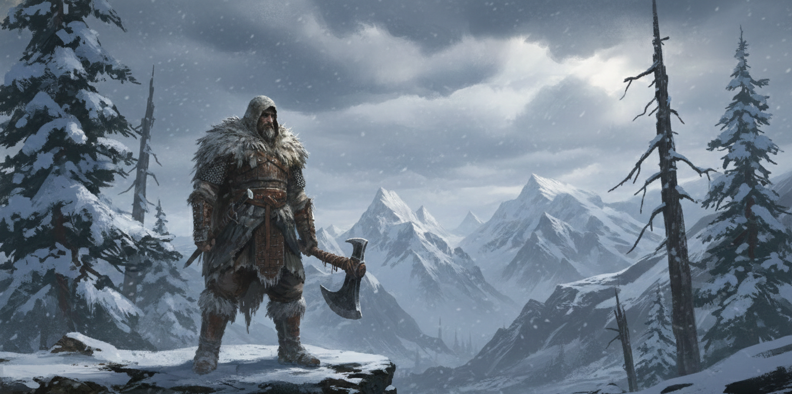
*The wind cuts like a knife in the wild lands, and graves are dug shallow in the frozen earth. Your people survive on loyalty, debt, and the grim knowledge that winter kills the weak.*

*   **Trait: Grim Resolve.** Once per day, when your life or honor is on the line, you may add your CON or INS tens digit as a bonus to any check.
*   **Heritage Skills:** Trained in Survival and Intimidate.
*   **Starting Equipment:** A whetstone, a flask of "North-Burn" spirits, or a carved bone token.
*   **Starting Currency:** 60 sp.

**Clansman Talents**

| Tier | Talent | Cost | Description |
| :--- | :--- | :--- | :--- |
| T1 | **Berserk** | 1 AP | Enter frenzy (advantage on attacks, no reactions). |
| T1 | **Heavy Hitter** | Passive | Use Logic instead of STR for attack with tools. |
| T1 | **Tribal Ferocity** | Passive | Advantage on melee attacks if you have taken damage. |
| T1 | **Mountain Born** | Passive | Ignore difficult terrain in cold/rocky areas. |
| T1 | **Blood Debt** | Free | Gain advantage on attacks if an ally is downed. |
| T1 | **North-Burn Breath** | Free | Drink spirits for 5 Temp HP. |
| T1 | **Skald's Song** | 1 AP | Battle cry: allies within 5m gain +1 next damage roll. |
| T1 | **Merciless** | Passive | Advantage on attacks vs injured enemies. |
| T1 | **Survival Instinct** | Passive | Advantage on survival checks. |
| T1 | **Combat Awareness** | Passive | Advantage on perception to avoid ambushes. |
| T2 | **Bloodied Fury** | Passive | HP < 50%: all attacks deal +5 damage. |
| T2 | **Blood Offering** | Free | Sacrifice 5 HP for +10 Damage. |
| T2 | **Peak Vision** | Passive | Advantage on perception in mountains. |
| T2 | **Slayer's Fury** | Free | Advantage and +10 damage (1/long rest). |
| T2 | **Defensive Stance** | 1 AP | Reduce damage taken by 2. |
| T3 | **Avalanche Strike** | 1 AP | 10m cone, knock prone. |
| T3 | **Shape Shift** | 1 AP | Werewolf form (+10 STR, Claw 7dmg). |

### Zealot

*Silence hangs heavy in the temple, broken only by the desperate prayers of the sick. Whether a true believer or a charlatan in a frayed robe, you have walked among the dying and seen what men will do when the gods turn their backs.*

*   **Trait: Unwavering.** You have advantage on checks to resist intimidation, fear, or magical influence.
*   **Heritage Skills:** Trained in Religion and Medicine.
*   **Starting Equipment:** A holy symbol (chipped), a small box of salt, or a roll of clean bandages.
*   **Starting Currency:** 50 sp.

**Zealot Talents**

| Tier | Talent | Cost | Description |
| :--- | :--- | :--- | :--- |
| T1 | **Vigil** | Passive | +5 Perception when guarding. |
| T1 | **Rites** | 1 AP | Remove minor curses/contamination. |
| T1 | **Whispered Secrets** | Passive | Advantage on occult/magic ID. |
| T1 | **Detect Illness** | 1 AP | Diagnose disease/curses. |
| T1 | **Eldritch Sight** | Passive | See magic auras. |
| T2 | **Empower** | 1 AP | Spend 1 IP for +10 damage. |
| T2 | **Hex Craft Novice** | 1 AP | Weave curses/blessings. |
| T2 | **Healing Touch** | 1 AP | Restore 10 HP to ally (1/day). |
| T2 | **Holy Aura** | Passive | Allies in 10m: +1 defense, advantage defense. |
| T2 | **Blood Offering** | Free | Sacrifice 5 HP for +10 Damage. |
| T2 | **Holy Weapon** | 1 AP | Coated in "holy" poison (+2 damage). |
| T2 | **Caregiver** | Passive | +20 on Aid rolls. |
| T2 | **Martyr's Shield** | Reaction | Take 50% of damage meant for ally. |
| T2 | **Rituals** | Action | Perform powerful, utility-focused rituals. |
| T2 | **Coven Bond** | Passive | +2 Spell Rolls near witches. |
| T2 | **Noble Aegis** | Passive | Allies in 5m: advantage vs fear/charm. |
| T3 | **Iron Will** | Free | Take dmg: gain pt for bonus or reaction. |
| T3 | **Unyielding Spirit** | Free | Fall to 0 HP: stay at 1 HP + 10 Temp HP. |
| T3 | **Strength in Grief** | 1 AP | Advantage on attack and defense for 1 turn. |
| T3 | **Dark Channel** | 1 AP | Aura +5 dmg/advantage, take 10 dmg/turn. |
| T3 | **Spirit Walker** | 1 AP | Commune with spirits. |
| T3 | **Abyssal Reckoning** | Passive | <10 HP: Resistance All, +5 Defense. |
| T3 | **Toughened Resolve** | Passive | Resistance Psychic. |
| T3 | **Imp. Tough. Resolve**| Passive | Immunity Psychic. |
| T3 | **Spell Ward** | Passive | Advantage to resist/cleanse spells. |
| T4 | **Death Awakens** | 1 AP | Revive ally with 15 HP (1/day). |
| T4 | **Guardian Aura** | Passive | Allies: +5 defense, resist fear. |

### Commoner

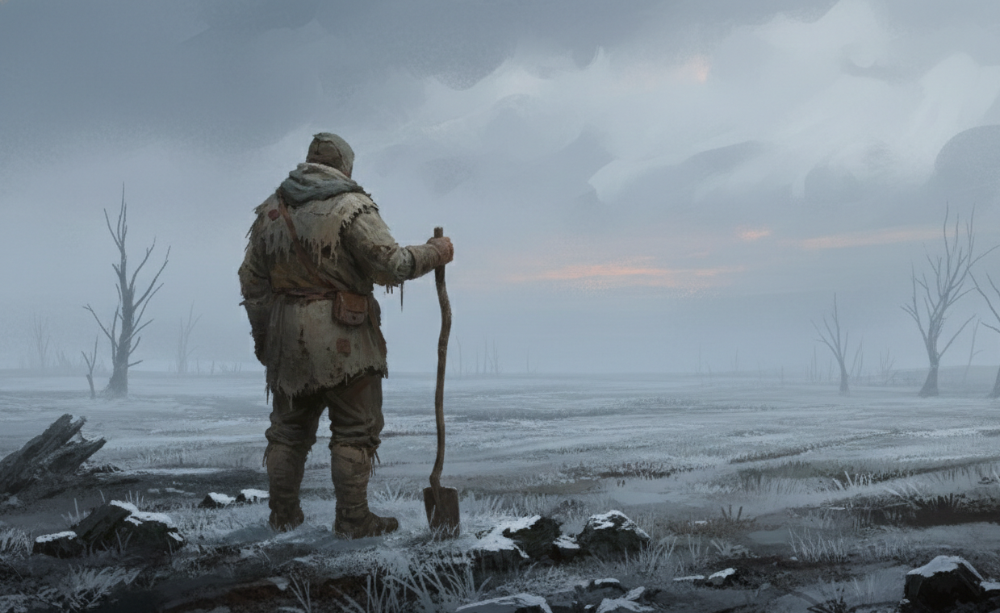
*Mud, toil, and the biting frost—these are the only constants. A bad harvest is a death sentence, and hunger is a wolf that never sleeps.*

*   **Trait: Sturdy-Built.** You can ignore all penalties from the first level of exhaustion.
*   **Heritage Skills:** Trained in Nature and Athletics.
*   **Starting Equipment:** A heavy wood-axe, a small bag of hardy seeds, or a sturdy iron cook-pot.
*   **Starting Currency:** 30 sp.

**Commoner Talents**

| Tier | Talent | Cost | Description |
| :--- | :--- | :--- | :--- |
| T1 | **Bounce Back** | Free | Advantage on check to avoid prone. |
| T1 | **Scythe Sweep** | 1 AP | Polearm/Scythe: hit two adjacent targets (half damage). |
| T1 | **Animal Husbandry** | Passive | Loyal farm animal assists in tracking/guarding. |
| T1 | **Weather Wise** | Free | Predict weather for 24h with 100% accuracy. |
| T1 | **Seasoned Toil** | Passive | +5 to Constitution checks. |
| T1 | **Improvised Defense**| Passive | Use pitchfork/shovel as shield (+5 Defense). |
| T1 | **Animal Handler** | Passive | Advantage on animal training checks. |
| T2 | **Caregiver** | Passive | +20 on Aid rolls. |
| T2 | **Healing Leaf** | 1 AP | Create poultice (10 HP). |
| T2 | **Stone’s Fortitude** | Passive | Resistance to Blunt, +5 CON checks. |
| T3 | **Durable** | Passive | +5 Natural Defense. |
| T3 | **Storm Watcher** | Passive | Detect storms, survival advantage. |
| T4 | **Steel Resolve** | Passive | Gain +2 Defense against physical. |

### Artisan

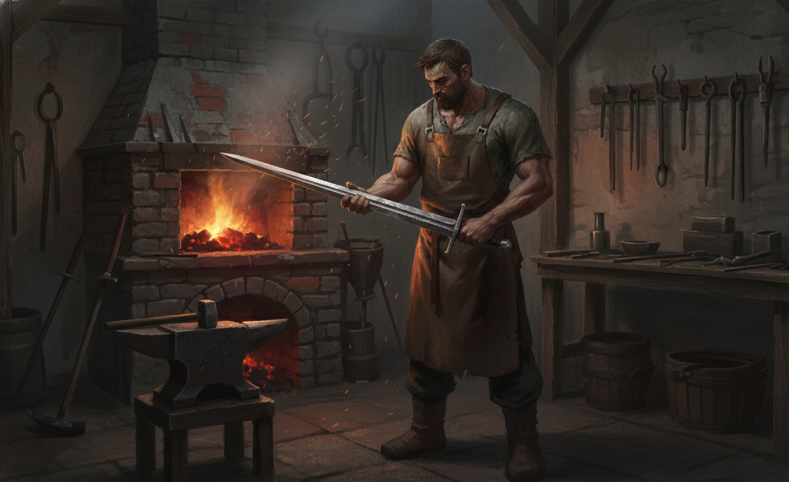
*In a world of rust and ruin, things must be forged to last. The smell of hot iron and oil is more comforting than perfume, and a well-made tool is worth more than a crown.*

*   **Trait: Eye for Detail.** You have advantage on appraise or engineering checks to identify flaws or value in physical objects.
*   **Heritage Skills:** Trained in Crafting and Engineering.
*   **Starting Equipment:** A set of masterwork tools, a leather apron, or a small bag of scrap metal.
*   **Starting Currency:** 60 sp.

**Artisan Talents**

| Tier | Talent | Cost | Description |
| :--- | :--- | :--- | :--- |
| T1 | **Smart Fighting** | Passive | In cover: advantage on active defense. |
| T1 | **Expert** | Free | Advantage on one skill check/day. |
| T1 | **Master Crafter** | Passive | Advantage on all Crafting checks. |
| T1 | **Structural Weakness**| Passive | Identify flaws; advantage on dmg vs objects/armor. |
| T1 | **Field Repairs** | Free | Repair one item during a short rest. |
| T1 | **Gadgeteer** | Free | Once/day: create gadget for advantage on one task. |
| T1 | **Heavy Hitter** | Passive | Use Logic instead of STR for attack with tools. |

### Merchant

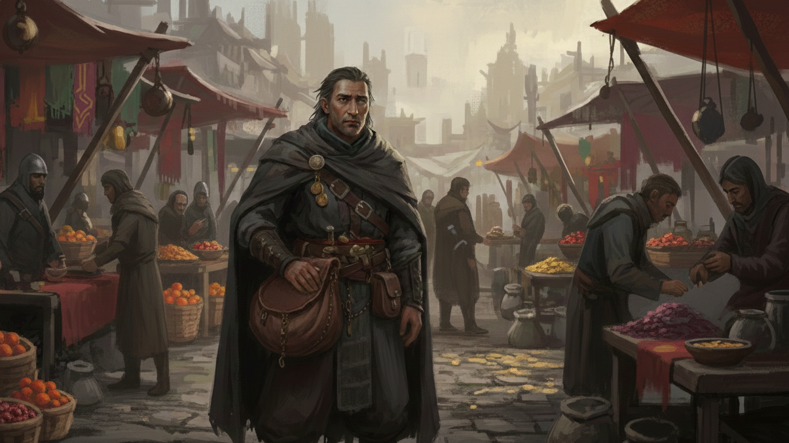
*Gold is the only shield that doesn't rust. Raised among the chaotic markets and dangerous trade routes, survival meant spotting a lie before it was spoken.*

*   **Trait: Master of Coin.** You have advantage on barter or persuade checks when negotiating prices or trade deals.
*   **Heritage Skills:** Trained in Barter and Appraise.
*   **Starting Equipment:** A set of brass scales, a concealed dagger, or a map with safe routes marked.
*   **Starting Currency:** 120 sp.

**Merchant Talents**

| Tier | Talent | Cost | Description |
| :--- | :--- | :--- | :--- |
| T1 | **Master of Barter** | Passive | Advantage on all Barter checks. |
| T1 | **Spot the Lie** | Passive | Advantage on Insight vs deception in trade. |
| T1 | **Hidden Pocket** | Passive | Concealed space for 3 small items. |
| T1 | **Network of Contacts**| Free | Find contact in settlement for info or discount. |
| T1 | **Distracting Coin** | 1 AP | Target within 5m has disadvantage on next roll. |
| T1 | **Beauty** | Passive | Advantage on CHA vs attracted targets. |
| T1 | **Streetwise** | Passive | Advantage on LOG checks regarding crime. |
| T1 | **Information Network**| Free | Access to thieves' network for info. |
| T1 | **Gilded Words** | Passive | Successful persuade also charms target. |
| T2 | **Fence Contacts** | Free | Sell stolen goods. |
| T2 | **High Stakes Neg.** | Passive | Use CHA instead of AGI for initiative. |
| T3 | **Right of Passage** | 1 AP | Allies move through enemy spaces freely. |

### Noble

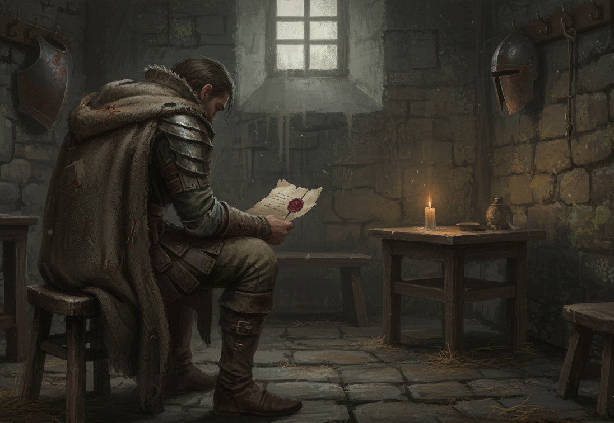
*Drafty halls filled with the ghosts of past glories were your playground, teaching the bitter taste of pride without gold. The world may have forgotten your family's honor, but you have not.*

*   **Trait: Silver Tongue.** You have advantage on persuade or diplomacy checks when dealing with authority figures or high-society.
*   **Heritage Skills:** Trained in Diplomacy and History.
*   **Starting Equipment:** A heavy signet ring (worth 10sp), a fine but frayed cloak, or a letter of debt owed to your family.
*   **Starting Currency:** 100 sp.

**Noble Talents**

| Tier | Talent | Cost | Description |
| :--- | :--- | :--- | :--- |
| T1 | **Spot the Lie** | Passive | Advantage on Insight vs deception in trade. |
| T1 | **Distracting Coin** | 1 AP | Target within 5m has disadvantage on next roll. |
| T1 | **Skald's Song** | 1 AP | Battle cry: allies within 5m gain +1 next damage roll. |
| T1 | **Storyteller** | Passive | Advantage on CHA to inspire/persuade. |
| T1 | **Witty Response** | Free | Advantage on skill check after witty retort. |
| T1 | **Beauty** | Passive | Advantage on CHA vs attracted targets. |
| T1 | **False Persona** | 1 AP | Assume a disguise; cannot use other talents. |
| T1 | **Mounted Combat** | Passive | +5 Damage while mounted. |
| T1 | **Sanctuary of Status**| Passive | Enemies must pass INS check to attack you first. |
| T1 | **Gilded Words** | Passive | Successful persuade also charms target. |
| T1 | **Master of Etiquette**| Passive | Never surprised in social situations. |
| T2 | **Shadow Step** | 1 AP | Move 10m ignoring opportunity attacks. |
| T2 | **Blade Dancer** | 1 AP | +2 Dmg and advantage on melee for 1 turn. |
| T2 | **Veil of Illusion** | 1 AP | Invisibility for 1 round. |
| T2 | **Disguise Mastery** | Passive | Disguise 50+ required. |
| T2 | **Fake Attack** | 1 AP | Target avoids any more attacks this round. |
| T2 | **Redirection** | Reaction | Give ally a reaction to avoid/block. |
| T2 | **Sovereign Mandate** | 1 AP | Command a creature to "Halt", "Flee", etc. |
| T2 | **Noble Aegis** | Passive | Allies in 5m: advantage vs fear/charm. |
| T2 | **High Stakes Neg.** | Passive | Use CHA instead of AGI for initiative. |
| T3 | **Dirge of Despair** | 1 AP | Enemies in 15m: -5 Attack for 3 turns. |
| T3 | **Siren's Call** | 1 AP | Charm creature (CHA 60+). |
| T3 | **Heirloom Relic** | Passive | Item with +5 bonus. |
| T3 | **Right of Passage** | 1 AP | Allies move through enemy spaces freely. |
| T4 | **Harbinger's Lament** | 1 AP | 15 Psychic Dmg + Stun to enemies in 20m. |
| T4 | **Inspiring Presence** | Passive | Allies: advantage on first roll. |

### Outcast

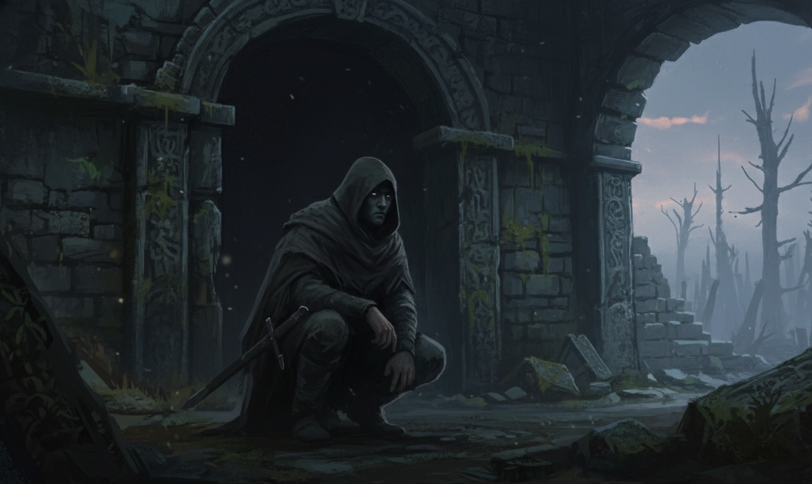
*While decent folk sleep behind locked doors, you learned to be invisible, eating scraps and sleeping with one eye open. Society rejected you, so you learned to survive without it.*

*   **Trait: Hardened Survivor.** You have learned to live on the fringes of society. You have advantage on Stealth and Survival checks when in urban environments or ruins.
*   **Heritage Skills:** Trained in Occult Knowledge and Investigation.
*   **Starting Equipment:** A rusted knife, a lucky charm made of bone, or a heavy hood.
*   **Starting Currency:** 40 sp.

**Outcast Talents**

| Tier | Talent | Cost | Description |
| :--- | :--- | :--- | :--- |
| T1 | **Dodge** | Reaction | AGI check to avoid attack. |
| T1 | **Hidden Pocket** | Passive | Concealed space for 3 small items. |
| T1 | **Storyteller** | Passive | Advantage on CHA to inspire/persuade. |
| T1 | **Witty Response** | Free | Advantage on skill check after witty retort. |
| T1 | **Dirty Fighting** | Passive | Advantage vs surprised enemies. |
| T1 | **Streetwise** | Passive | Advantage on LOG checks regarding crime. |
| T1 | **Sneak Attack** | Passive | +5 damage vs unaware enemy. |
| T1 | **Intimidation** | 1 AP | Force morale check or target has disadvantage. |
| T1 | **False Persona** | 1 AP | Assume a disguise; cannot use other talents. |
| T1 | **Information Network**| Free | Access to thieves' network for info. |
| T1 | **Merciless** | Passive | Advantage on attacks vs injured enemies. |
| T1 | **Spell Craft** | Passive | Cast spells using INS attribute. |
| T2 | **Dual Wielding** | 1 AP | Attack with both weapons (one roll). |
| T2 | **Shadow Step** | 1 AP | Move 10m ignoring opportunity attacks. |
| T2 | **Blade Dancer** | 1 AP | +2 Dmg and advantage on melee for 1 turn. |
| T2 | **Veil of Illusion** | 1 AP | Invisibility for 1 round. |
| T2 | **Fence Contacts** | Free | Sell stolen goods. |
| T2 | **Disguise Mastery** | Passive | Disguise 50+ required. |
| T2 | **Exploit Opening** | Passive | Rearguard: +10 Dmg if target missed you/ally. |
| T2 | **Fake Attack** | 1 AP | Target avoids any more attacks this round. |
| T2 | **Shadow Shield** | Passive | Absorb 3 damage. |
| T2 | **Trap Expertise** | 1 AP | Set traps (+2 Dmg). |
| T3 | **Coup de Grace** | 1 AP | Double damage if target prone/stunned. |
| T3 | **Mystic Shroud** | 1 AP | Invisibility for 3 turns (non-combat). |
| T3 | **Flanking** | Passive | Advantage if ally on opposite side. |
| T3 | **Canopy Cloak** | 1 AP | Invisibility in woods. |
| T3 | **Teleport** | 1 AP | 20m teleport to shadow. |

### Veteran

*You have spent your years in the shield wall, or perhaps as a mercenary in lands where life is cheap. You know the weight of cold steel and the sound of a dying man's breath. Peace is just a pause between battles.*

*   **Trait: Combat Reflexes.** You gain +1 to your Reaction Pool for the first round of any encounter.
*   **Heritage Skills:** Trained in Warfare and Athletics.
*   **Starting Equipment:** A whetstone, a notch-filled dagger, or a tattered company banner.
*   **Starting Currency:** 60 sp.

**Veteran Talents**

| Tier | Talent | Cost | Description |
| :--- | :--- | :--- | :--- |
| T1 | **First Strike** | 1 AP | Make an attack. Rearguard: +5 damage. |
| T1 | **Vanguard's Lead** | Free | Move 3m+ in vanguard: one ally gains 1 reaction. |
| T1 | **The Charge** | 1 AP | Move Speed in line + attack. 3m+: +5 damage. |
| T1 | **Parry** | Reaction | AGI check to parry melee. Reduce dmg by weapon + DoS. |
| T1 | **Intimidation** | 1 AP | Force morale check or target has disadvantage. |
| T1 | **Vigil** | Passive | +5 Perception when guarding. |
| T1 | **Endurance Training** | Passive | Increase Max HP by 5. |
| T1 | **Combat Awareness** | Passive | Advantage on perception (ambush). |
| T1 | **Mounted Combat** | Passive | +5 Damage while mounted. |
| T2 | **Battle Scarred** | Passive | Choose damage type; reduce by 50%. |
| T2 | **Cleave** | Passive | On kill: free attack against nearby enemy. |
| T2 | **Martyr's Shield** | Reaction | Take 50% of damage meant for ally. |
| T2 | **Precision Strikes** | Passive | +5 Attack vs creatures. |
| T2 | **Pack Tactics** | Passive | Advantage if ally within 2m of target. |
| T2 | **Tactical Maneuvering**| Free | Move 10m free action. |
| T2 | **Defensive Stance** | 1 AP | Reduce damage by 2. |
| T2 | **Weapon Spec.** | Passive | +1 Dmg, +5 Hit with chosen weapon. |
| T2 | **Guardian** | Reaction | Redirect attack from adjacent ally to self. |
| T2 | **Redirection** | Reaction | Give ally a reaction to avoid/block. |
| T3 | **Counter Attack** | Reaction | Halve dmg, immediately make melee attack. |
| T3 | **Duelist** | Passive | +1 additional Reaction pool. |
| T3 | **Flanking** | Passive | Advantage if ally on opposite side. |
| T3 | **Alertness** | Passive | Cannot be surprised. |
| T3 | **Master Tactician** | Free | Grant allies advantage (1/long rest). |
| T3 | **Shield of the People**| 1 AP | Redirect all attacks against adjacent ally. |
| T3 | **Heirloom Relic** | Passive | Item with +5 bonus. |
| T3 | **Vanguard Reflexes** | Passive | Regain 1 reaction at start of each round. |
| T4 | **Battle Plan** | Free | Party gets advantage on initiative. |
| T4 | **Master of Defense** | Passive | Advantage on all active defense rolls. |
| T4 | **Combat Transcend** | 1 AP | 3 rounds: advantage defense, free dodges. |
| T4 | **Inspiring Presence** | Passive | Allies: advantage on first roll. |
| T4 | **Guardian Aura** | Passive | Allies: +5 defense, resist fear. |
| T4 | **Tactician's Insight** | Passive | Allies: +5 dmg vs enemy. |

### Warden

*You are a guardian of the wild places, or perhaps a hunter who respects the balance of the forest. You know that nature is neither kind nor cruel—it is simply hungry. You walk where others fear to tread.*

*   **Trait: Tracker's Eye.** You have advantage on Perception and Survival checks to track creatures or find water in the wilderness.
*   **Heritage Skills:** Trained in Nature and Survival.
*   **Starting Equipment:** A hunting trap, a small bag of dried meat, or a necklace of animal teeth.
*   **Starting Currency:** 40 sp.

**Warden Talents**

| Tier | Talent | Cost | Description |
| :--- | :--- | :--- | :--- |
| T1 | **Mountain Born** | Passive | Ignore difficult terrain in cold/rocky areas. |
| T1 | **Scythe Sweep** | 1 AP | Polearm/Scythe: hit two adjacent targets (half damage). |
| T1 | **Animal Husbandry** | Passive | Loyal farm animal assists in tracking/guarding. |
| T1 | **Eyes of the Night** | Passive | Low-light vision, advantage on perception in dark. |
| T1 | **Detect Illness** | 1 AP | Diagnose disease/curses. |
| T1 | **Naturalistic Bolster**| 1 AP | Grant 5 Temp HP (1/long rest). |
| T1 | **Sylvan Whisper** | 1 AP | Speak with animals/plants. |
| T1 | **Bird-man** | Passive | Pet bird (Carry message, Hunt, Track). |
| T1 | **Survival Instinct** | Passive | Advantage on survival. |
| T1 | **Animal Handler** | Passive | Advantage on animal training checks. |
| T1 | **Endurance Training** | Passive | Increase Max HP by 5. |
| T1 | **Hunter's Mark** | 1 AP | Target is marked. You deal +2 damage to them. |
| T2 | **Healing Leaf** | 1 AP | Create poultice (10 HP). |
| T2 | **Guardian Resilience**| Passive | +5 Defense in home terrain. |
| T2 | **Stone’s Fortitude** | Passive | Resistance to Blunt, +5 CON checks. |
| T2 | **Peak Vision** | Passive | Advantage on perception in mountains. |
| T2 | **Ocean’s Blessing** | Passive | Resistance Cold, Water breathing. |
| T2 | **Tide Caller** | 1 AP | Slow enemies (Half Speed). |
| T2 | **Entangling Vines** | 1 AP | Immobilize foes (STR check). |
| T2 | **Precision Strikes** | Passive | +5 Attack vs creatures. |
| T2 | **Trap Expertise** | 1 AP | Set traps (+2 Dmg). |
| T2 | **Uncanny Defense** | Reaction | Halve damage. |
| T2 | **Slayer's Fury** | Free | Advantage and +10 damage (1/long rest). |
| T2 | **Apex Predator** | Passive | Sense supernatural. |
| T2 | **Pack Tactics** | Passive | Advantage if ally within 2m of target. |
| T3 | **Spirit Walker** | 1 AP | Commune with spirits. |
| T3 | **Storm Watcher** | Passive | Detect storms, survival advantage. |
| T3 | **Canopy Cloak** | 1 AP | Invisibility in woods. |
| T3 | **Spiritual Shackles** | 1 AP | Immobilize + 5 Dmg. |
| T3 | **Toughened Resolve** | Passive | Resistance Psychic. |
| T3 | **Slayer's Mark** | 1 AP | Marked target: allies deal +5 damage. |
| T3 | **Alertness** | Passive | Cannot be surprised. |
| T3 | **Master Tactician** | Free | Grant allies advantage (1/long rest). |
| T3 | **Imp. Tough. Resolve**| Passive | Immunity Psychic. |
| T3 | **Familiar** | Passive | Spiritual familiar scouts and delivers spells. |

### Wanderer

*You are a drifter, an exile, or perhaps someone touched by a curse that keeps you moving. You have seen things that would break a lesser mind, and you carry the weight of your past like a heavy cloak.*

*   **Trait: Cursed Insight.** Once per day, you may ask the GM one question about a person or place. The GM will provide a cryptic but truthful answer.
*   **Heritage Skills:** Trained in Occult Knowledge and Investigation.
*   **Starting Equipment:** A hooded lantern, a book of strange drawings, or a piece of leaden jewelry.
*   **Starting Currency:** 30 sp.

**Wanderer Talents**

| Tier | Talent | Cost | Description |
| :--- | :--- | :--- | :--- |
| T1 | **Eyes of the Night** | Passive | Low-light vision, advantage on perception in dark. |
| T1 | **Rites** | 1 AP | Remove minor curses/contamination. |
| T1 | **Whispered Secrets** | Passive | Advantage on occult/magic ID. |
| T1 | **Sylvan Whisper** | 1 AP | Speak with animals/plants. |
| T1 | **Hopeless Resilience**| Passive | Resistance psychic, advantage vs curses. |
| T1 | **Ghostly Presence** | 1 AP | Phase through objects (1 turn). |
| T1 | **Eldritch Sight** | Passive | See magic auras. |
| T1 | **Spell Craft** | Passive | Cast spells using INS attribute. |
| T2 | **Blind Fighting** | Passive | Ignore penalties for darkness/invisibility. |
| T2 | **Hex Craft Novice** | 1 AP | Weave curses/blessings. |
| T2 | **Cursed Aura** | Passive | Enemies -5 Attack/Saves. |
| T2 | **Shadow Shield** | Passive | Absorb 3 damage. |
| T2 | **Apex Predator** | Passive | Sense supernatural. |
| T2 | **Rituals** | Action | Perform powerful, utility-focused rituals. |
| T2 | **Coven Bond** | Passive | +2 Spell Rolls near witches. |
| T3 | **Dirge of Despair** | 1 AP | Enemies in 15m: -5 Attack for 3 turns. |
| T3 | **Siren's Call** | 1 AP | Charm creature (CHA 60+). |
| T3 | **Mystic Shroud** | 1 AP | Invisibility for 3 turns (non-combat). |
| T3 | **Bane of Fate** | 1 AP | 5 Dmg AOE + -5 Penalty. |
| T3 | **Fortune's Reversal** | Reaction | Enemy misses or backfires. |
| T3 | **Teleport** | 1 AP | 20m teleport to shadow. |
| T3 | **Spiritual Shackles** | 1 AP | Immobilize + 5 Dmg. |
| T3 | **Abyssal Reckoning** | Passive | <10 HP: Resistance All, +5 Defense. |
| T3 | **Master of Misfortune**| Passive | Double curse penalties. |
| T3 | **Familiar** | Passive | Spiritual familiar scouts and delivers spells. |
| T3 | **Spell Ward** | Passive | Advantage to resist/cleanse spells. |
| T3 | **Abyssal Affinity** | Free | Spend 2 IP for Double Damage spell. |
| T3 | **Shape Shift** | 1 AP | Werewolf form (+10 STR, Claw 7dmg). |
| T4 | **Harbinger's Lament** | 1 AP | 15 Psychic Dmg + Stun to enemies in 20m. |
| T4 | **Fate's Embrace** | Passive | Invincible 3 turns. |
| T4 | **Cursed Rebirth** | Passive | Revive with 15 HP (1/long rest). |

### Course of Life

Describe your character. Are you generous? Do you like animals? What are your goals? Keep a journal of your adventures, friends, and enemies.

### Skills

Skills represent your character's training and experience.

*   **Base Skill**: Your base score in any skill is equal to its associated Attribute / 2.
*   **Trained**: You are specialized in this skill. A Trained skill is equal to its associated Attribute in full. At character creation, you gain 2 Trained Skills from your Heritage, 1 Combat Style, and select 3 additional Trained Skills from the list below. After that you can increase your skills by using XP. Only trained skills can be improved by XP. To "unlock" an untrained skill into a trained skill you need to spend 5 XP at once, representing dedicated training. After that, you can increase the skill score using XP.

#### Skill List

| Skill                | Attribute | Description                           |
| :------------------- | :-------: | :------------------------------------ |
| Acrobatics           |    AGI    | Balance, tumbling.                    |
| Alchemy              |    LOG    | Create potions and brews.             |
| Animal Training      |    CHA    | Train animals.                        |
| Appraise             |    LOG    | Estimate value of items.              |
| Athletics            |    STR    | Scaling walls/trees, jumping, swimming, physical feats. |
| Barter               |    CHA    | Negotiate prices.                     |
| Bluff                |    CHA    | Deception.                            |
| Crafting             |    LOG    | Making items.                         |
| Diplomacy            |    CHA    | Negotiation and peace-making.         |
| Disguise             |    LOG    | Changing appearance.                  |
| Drive Vehicle        |    AGI    | Controlling carts/wagons.             |
| Engineering          |    LOG    | Mechanics, gadgets.                   |
| Entertain            |    CHA    | Performance.                          |
| History              |    LOG    | Knowledge of the past.                |
| Intimidate           |    CHA    | Coercion through fear.                |
| Investigation        |    LOG    | Finding clues.                         |
| Linguistics          |    LOG    | Read/write languages.                 |
| Medicine             |    LOG    | Treating disease/injury, anatomy, first aid. |
| Nature               |    LOG    | Knowledge of the wild, plants, and animals. |
| Navigation           |    LOG    | Finding your way.                     |
| Occult Knowledge     |    LOG    | Magic, monsters, dark beings.         |
| Perception           |    INS    | Spotting hidden things (Sixth Sense). |
| Persuade             |    CHA    | Convincing others.                    |
| Religion             |    LOG    | Knowledge of gods/cults.              |
| Riding               |    AGI    | Riding mounts.                        |
| Seafaring            |    LOG    | Boating knowledge.                    |
| Stealth              |    AGI    | Hiding and moving silently.           |
| Survival             |    CON    | Enduring harsh environments.          |
| Thievery             |    AGI    | Pickpocket, lockpicking.              |
| Tracking             |    LOG    | Following trails.                     |
| Warfare              |    LOG    | Tactics and strategy.                 |

### Combat Styles

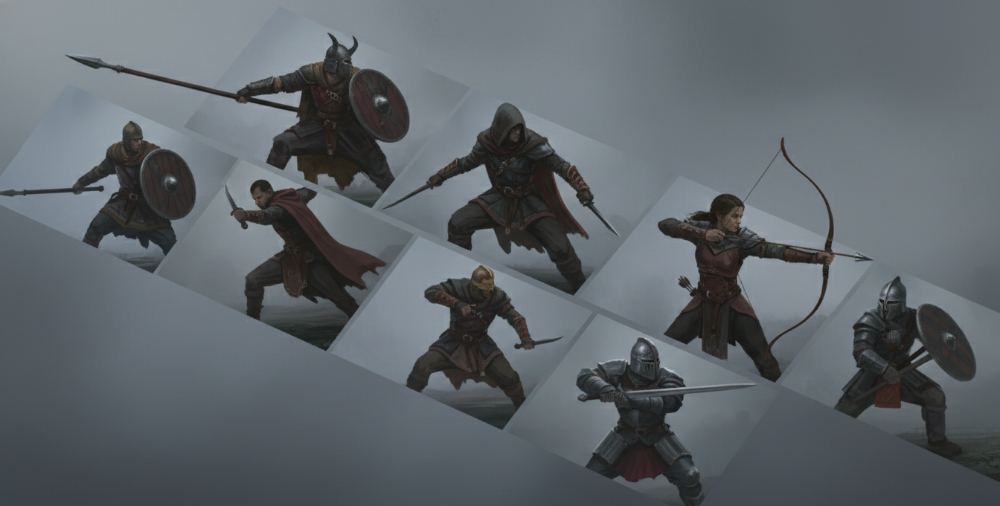

Combat styles represent your character's training in specific forms of combat. They have a base value of attribute / 2 and become the full attribute when trained. They determine which weapons you can use effectively and often unlock specific talents.

At character creation, you can choose one combat style if your heritage don't say otherwise.

#### Finesse

*   **Attribute**: AGI
*   **Applicable Weapons**: Daggers, Short Swords, Rapiers.

*   **Riposte (T2)**: Reaction. After a successful Parry, make an immediate counter-attack with that weapon.

#### One-Handed

*   **Attribute**: STR
*   **Applicable Weapons**: Long Swords, Hand Axes, Maces, Bastard Swords (1H).

*   **Swift Blade (T1)**: Passive. Drawing or sheathing a one-handed weapon is a zero cost action.

#### Two-Handed

*   **Attribute**: STR
*   **Applicable Weapons**: Great Swords, Great Axes, Bastard Swords (2H).

*   **Breaker (T2)**: Action (1 AP). Powerful blow. Ignores defense. If damage > 10, target is knocked prone.

#### Polearms

*   **Attribute**: STR
*   **Applicable Weapons**: Short Spears, Pikes, Halberds.

*   **Sentinel (T2)**: Reaction. Attack enemy entering your reach. On hit, their movement becomes 0 for the turn.

#### Marksmanship

*   **Attribute**: AGI
*   **Applicable Weapons**: Short Bows, Long Bows, Crossbows.

*   **Calm Shooting (T1)**: Passive. Ranged attacks treat Heavy cover as Light, and ignore Light cover.
*   **Crossbow Expert (T1)**: +1 Damage with crossbows.
*   **Far Shooting (T2)**: Ranged weapon range +25%.
*   **Flurry of Arrows (T2)**: Action (1 AP). Make one attack. If it hits, you deal your weapon damage three times (without DoS).

#### Throwing

*   **Attribute**: AGI
*   **Applicable Weapons**: Thrown Daggers, Hand Axes, Javelins.

*   **Far Throwing (T2)**: Action (1 AP). Opposed STR (athletics) check vs target STR. On success, throw humanoid 20m. Target takes 5 damage per 5m thrown.

#### Unarmed

*   **Attribute**: STR
*   **Applicable Weapons**: Fists, Natural Weapons, Grappling.

*   **Brawler (T2)**: Action (1 AP). Opposed STR (unarmed) check vs target AGI or STR. Success: Target restrained. Deal unarmed damage as a free action each turn held.

#### Shields

*   **Attribute**: STR
*   **Applicable Weapons**: Bucklers, Round Shields, Kite Shields, Tower Shields, Greatshields.

*   **Blocker (T1)**: Unlock the block reaction. Use shield skill to reduce damage.
*   **Shield Bash (T1)**: Strike with shield (Damage = Shield Defense + DoS).
*   **Shield Wall (T2)**: Passive. Adjacent allies gain +2 Defense. Reaction: After a successful Block, make a free Shield Bash attack.
*   **Shield Edge (T3)**: You have advantage on attacks against an enemy you have immobilized with your shield.

## Talents

### The Talent Pyramid

To ensure a broad base of abilities, you must follow the Talent Pyramid. You cannot specialize in high-tier powers without a foundation of lower-tier skills.

*   Tier 1: Cost 5 XP.
*   Tier 2: Cost 10 XP.
*   Tier 3: Cost 15 XP.
*   Tier 4: Cost 20 XP.

> **The Rule of More**: At any time, you must have more talents in a given tier than you have in the tier directly above it.
> *   Example: To take your first Tier 2 talent, you must have at least two Tier 1 talents. To take a second Tier 2 talent, you must have at least three Tier 1 talents.
>
> **Tag Path Rule**: To take a Talent of Tier 2 or higher with a specific heritage, you must already possess at least one talent with that same in the tier directly below it. (e.g., to take a T2 [Warden] talent, you must have at least one T1 [Warden] talent).

### Talent Index
Talents are grouped by their associated heritage. Follow the links below to find the talents for your character:

*   **General Talents** (Available to all)
*   [Clansman Talents](#clansman)
*   [Zealot Talents](#zealot)
*   [Commoner Talents](#commoner)
*   [Artisan Talents](#artisan)
*   [Merchant Talents](#merchant)
*   [Noble Talents](#noble)
*   [Outcast Talents](#outcast)
*   [Veteran Talents](#veteran)
*   [Warden Talents](#warden)
*   [Wanderer Talents](#wanderer)

### General Talents
General talents are available to any character, regardless of their Heritage.

| Tier | Talent | Cost | Description |
| :--- | :--- | :--- | :--- |
| T1 | **Focus** | 1 AP | Your next attack this turn has advantage. |
| T1 | **Overdrive** | 1 AP | Your next attack this turn adds degree of success to damage. |
| T1 | **Berserk** | 1 AP | Enter frenzy (advantage on attacks, no reactions). |
| T1 | **First Strike** | 1 AP | Make an attack. Rearguard: +5 damage. |
| T1 | **Vanguard's Lead** | Free | Move 3m+ in vanguard: one ally gains 1 reaction. |
| T1 | **Desperate Attack** | 1 AP | Move 5m with attack action. |
| T1 | **The Charge** | 1 AP | Move Speed in line + attack. 3m+: +5 damage. |
| T1 | **Smart Fighting** | Passive | In cover: advantage on active defense. |
| T1 | **Dodge** | Reaction | AGI check to avoid attack. |
| T1 | **Expert** | Free | Advantage on one skill check/day. |
| T1 | **Parry** | Reaction | AGI check to parry melee. Reduce dmg by weapon + DoS. |
| T1 | **Bounce Back** | Free | Advantage on check to avoid prone. |
| T2 | **Relentless Pursuit** | 1 AP | Move 10m and attack as single action. |
| T2 | **Battle Scarred** | Passive | Choose damage type; reduce by 50%. |
| T2 | **Harrying Strike** | 1 AP | Target has disadvantage on next defense. |
| T2 | **Bloodied Fury** | Passive | HP < 50%: all attacks deal +5 damage. |
| T2 | **Empower** | 1 AP | Spend 1 IP for +10 damage. |
| T2 | **Jack of all Trades** | Passive | Lowest skills set to second-lowest value. |
| T2 | **Cleave** | Passive | On kill: free attack against nearby enemy. |
| T2 | **Dual Wielding** | 1 AP | Attack with both weapons (one roll). |
| T2 | **Blind Fighting** | Passive | Ignore penalties for darkness/invisibility. |
| T2 | **Uncanny Defense** | Reaction | Halve damage. |
| T3 | **Counter Attack** | Reaction | Halve dmg, immediately make melee attack. |
| T3 | **Duelist** | Passive | +1 additional Reaction pool. |
| T3 | **Iron Will** | Free | Take dmg: gain pt for bonus or reaction. |
| T3 | **Coup de Grace** | 1 AP | Double damage if target prone/stunned. |
| T3 | **Tempo** | Free | Advantage on initiative checks. |
| T3 | **Durable** | Passive | +5 Natural Defense. |
| T3 | **Unyielding Spirit** | Free | Fall to 0 HP: stay at 1 HP + 10 Temp HP. |
| T4 | **Battle Plan** | Free | Party gets advantage on initiative. |
| T4 | **Master of Defense** | Passive | Advantage on all active defense rolls. |
| T4 | **Steel Resolve** | Passive | Gain +2 Defense against physical. |
| T4 | **Combat Transcend** | 1 AP | 3 rounds: advantage defense, free dodges. |

## Encounters

Combat in Eda is resolved in a series of rounds. Each round represents approximately 10 seconds of in-game time. During a round each combatant take one turn each.

### Initiative

At the start of every round, only the player characters (PCs) roll for initiative. Roll a check against your AGI.

*   **Vanguard Turn (Success)**: If you succeed, you act before the enemies.
*   **Rearguard Turn (Failure)**: If you fail, you act after the enemies.
*   **Enemies**: All enemies act between the vanguard and rearguard turns.
*   **Group Coordination**: Players acting in the same turn (Vanguard or Rearguard) may act in any order they choose.

### Actions

On your turn, you receive 2 Action Points (AP) and 1 Zero Cost Action.

#### Standard Actions

*   **Move (1 AP)**: Move a distance up to your Speed (AGI / 10 meters).
    *   **Evasive Stance**: If you move at least 3 meters during your turn, you gain the evasive status until the start of your next turn. You gain +3 defense against all attacks while you are evasive.
*   **Attack (1 AP)**: Make an attack using a combat style.
    *   **Multiple Attack Penalty (MAP)**: If you perform more than one attack action in a single turn, any attack after the first is made at /2 skill chance.
*   **Help (1 AP)**: Assist an ally within melee range, granting them advantage on their next action.
*   **Interact (1 AP)**: Open a door, light a torch, or manipulate an object.
*   **Swap Weapon (1 AP)**: Draw or sheathe a weapon.
*   **Mount/Dismount (1 AP)**: Get on or off a mount or vehicle.
*   **Stand Up (1 AP)**: Rise from a prone or seated position.
*   **Use Talent/Skill (Variable)**: Use an ability as described in its text (usually 1 AP).
*   **Prepare (1 AP)**: Save an action to be used as a reaction later in the round.

#### The Wait Action
A player in the vanguard turn can spend their zero cost action to wait. This drops them to the rearguard turn, effectively trading initiative for better positioning, observation, or recovery.

*   **Momentum**: By waiting and observing the enemy, the player gains momentum. When acting in the rearguard turn, they regain 1 spent reaction to their pool.

### Damage & Health

*   **Damage**: Total damage is calculated as weapon base damage + degree of success (DoS).
*   **Reduction**: Damage is reduced by **Defense** (the sum of armor and shield values) before being applied to HP.
*   **Death**: At 0 HP.

### Wounds & Injuries

Combat in Eda is dangerous. While Hit Points (HP) represent your overall health, **Wounds** and **Injuries** represent  physical trauma that degrades your ability to fight.

#### Bleeding
Every attack that deals damage (after armor reduction) inflicts the **Bleeding** condition.

*   **Trigger:** Any damaging hit.
*   **Effect:** Bleeding represents the cumulative toll of minor cuts and fatigue. While Bleeding, your **Defense is reduced by 2**. This penalty does not stack.
*   **Duration:** Bleeding persists until the end of the combat encounter.
*   **Treatment:** A successful **Medicine check** (Action) can remove the Bleeding condition.

#### 2. Injuries
When a character suffers a **Critical Hit** (rolling doubles under the attacker's skill, e.g., 11, 22, 33), they suffer an **Injury** in addition to the normal damage.

*   **Roll:** The player always roll a d100 on the **Injury Table**.
*   **Effect:** The table provides both a narrative description and a mechanical penalty (e.g., Stunned, Disadvantage, Broken Limb).
*   **Note:** Injuries are distinct from Bleeding and have their own specific durations/cures.

#### Injury Table (d100)

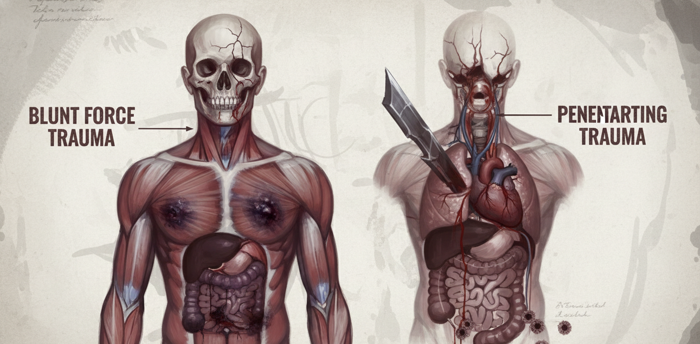

| Roll      | Severity     | Narrative Prompt                                            | Mechanical Effect                                                                                      |
| :-------- | :----------- | :---------------------------------------------------------- | :----------------------------------------------------------------------------------------------------- |
| **01-10** | **Minor**    | **Glancing Blow** - A jarring hit that rattles you.         | **Stunned:** You lose 1 Action Point (AP) on your next turn.                                           |
| **11-20** | **Minor**    | **Deep Gash** - A painful cut but clean.                    | **Pain:** -10 to your next check due to shock.                                                         |
| **21-30** | **Minor**    | **Knocked Senseless** - Ringing ears and blurred vision.    | **Disoriented:** Disadvantage on all Logic and Instinct checks for 1d4 rounds.                         |
| **31-40** | **Moderate** | **Leg Wound** - Muscle torn or bone chipped in the leg.     | **Hobbled:** Movement speed halved until healed.                                                       |
| **41-50** | **Moderate** | **Arm Wound** - Deep trauma to the arm or shoulder.         | **Weakened Grip:** Disadvantage on checks using that arm (Attacks, Climbing) until healed.             |
| **51-60** | **Moderate** | **Head Trauma** - A severe blow to the skull.               | **Concussion:** -10 to Logic and Instinct permanently (or until fully rested/healed).                  |
| **61-70** | **Severe**   | **Broken Ribs** - Breathing is agony.                       | **Winded:** You cannot take the "Sprint" action. -10 to Constitution checks.                           |
| **71-80** | **Severe**   | **Internal Injury** - Organs bruised or ruptured.           | **Vulnerable:** The Defense penalty from Bleeding is doubled (Total -4 Defense).                       |
| **81-85** | **Severe**   | **Mangled Limb** - An arm or leg is crushed or ruined.      | **Useless Limb:** The limb is unusable. If leg, prone and crawl only. If arm, drop items.              |
| **86-90** | **Severe**   | **Severed Extremity** - Fingers, toes, ear, or nose lost.   | **Permanent Loss:** -5 to relevant checks (e.g., Dexterity, Charisma) permanently.                     |
| **91-95** | **Lethal**   | **Mortal Wound** - A strike to the heart, throat, or brain. | **Dying:** You immediately drop to 0 HP and begin dying.                                               |
| **96-99** | **Lethal**   | **Severed Limb** - Arm or leg chopped off.                  | **Amputation:** Limb is gone. Constitution check or pass out immediately.                              |
| **00**    | **Fatality** | **Instant Death** - Decapitation or heart destroyed.        | **Dead:** Character is instantly killed.                                                               |

#### Healing & Recovery
*   **Bleeding:** Removed automatically at end of combat, or via Medicine (Action) during combat.
*   **Minor Injuries:** Heal naturally after a Long Rest.
*   **Moderate Injuries:** Require Medical attention.
*   **Severe Injuries:** Require Surgery.
*   **Lethal/Permanent:** Require high-level Magic or unique prosthetics to mitigate.

> #### Combat Example: The Pack Attacks
>
> Bjorn (AGI 65) and his companions Astrid (AGI 75) and Erik (AGI 50) are trekking through the Frostwood when three Gray Wolves emerge from the trees.
>
> **Round 1: Initiative**
>
> *   Bjorn rolls a 42 (Success). Acts in the Vanguard Turn.
>
> *   Erik rolls a 28 (Success). Acts in the Vanguard Turn.
>
> *   Astrid rolls a 81 (Failure). Acts in the Rearguard Turn.
>
> **Vanguard Turn (Bjorn & Erik)**
>
> 1.  Bjorn (Action 1 - Move): Moves 6 meters to intercept Wolf 1. Gains Evasive Stance (+3 Defense).
>
> 2.  Bjorn (Action 2 - Attack): Swings his Long Sword (STR 70). Rolls 25. Hit!
>
>     *   *DoS:* 2 (Roll 25).
>     *   *Damage:* 7 (Base) + 2 (DoS) = 9 damage.
>     *   *Result:* 9 - 1 (Wolf Defense) = 8 damage. Wolf 1 is injured (4/12 HP) and gains **1 Bleed Stack**.
>
> 3.  Erik (Action 1 - Move): Erik moves next to Astrid to protect her.
>
> 4.  Erik (Action 2 - Help): Erik uses Help to spot for Astrid, giving her advantage on her next attack.
>
> **Enemy Turn (Gray Wolves)**
>
> *   Wolf 1 (Injured, 1 Bleed): Bites Bjorn. Rolls 55 (Hit).
>     *   Bjorn spends his 1st Reaction (out of 6) to Block. He rolls a 30 (3 DoS).
>     *   *Reduction:* 2 (chain mail) + 2 (shield defense) + 3 (DoS) = 7. The wolf's 6 damage (1 base + 5 DoS) is fully negated.
> *   Wolf 2: Moves to flank Bjorn. With pack tactics, it has advantage. It rolls 15 and 70. Taking the 15: Hit!
>     *   Bjorn spends his 2nd reaction to dodge. He rolls a 42. Success! Bjorn leaps away from the snapping jaws.
>     *   *Result:* No damage taken.
> *   Wolf 3: Moves into melee with Bjorn. It bites with pack tactics (advantage), rolling 48 and 80. Taking the 48: Hit!
>     *   Bjorn spends his 3rd reaction to block. He rolls a 60 (6 DoS).
>     *   *Reduction:* 2 (Chain Mail) + 2 (Shield Defense) + 6 (DoS) = 10. The wolf's 6 damage (1 Base + 5 DoS) is fully negated.
>
> **Rearguard Turn (Astrid)**
> 1.  Astrid (Action 1 - Attack): Fires her short bow at Wolf 1. She has advantage (from Erik). She rolls 15 and 60. Taking the 15: Hit!
>     *   *DoS:* 1 (Roll 15).
>     *   *Damage:* 6 (Short Bow) + 1 (DoS) - (1 - 2) (Wolf Defense reduced by Bleed) = 8 damage. Wolf 1 is defeated!
> 2.  Astrid (Action 2 - Move): Moves to higher ground for safety.
>
> **Round 2: The Fight Continues**
>
> **Vanguard Turn (Bjorn & Erik)**
>
> 1.  Bjorn (Action 1 - Attack): Swings at Wolf 2 (adjacent). Rolls 45. Hit!
>     *   *DoS:* 4 (Roll 45).
>     *   *Damage:* 7 (base) + 4 (DoS) - 1 (wolf defense) = 10 damage. Wolf 2 is severely wounded (2/12 HP) and is now **Bleeding**.
> 2.  Bjorn (Action 2 - Attack): Quick follow-up on Wolf 2. Rolls 30. Hit!
>     *   *DoS:* 3 (Roll 30).
>     *   *Damage:* 7 (base) + 3 (DoS) - (1 - 2) (Wolf Defense reduced by Bleed) = 11 damage. Wolf 2 is defeated!
> 3.  Erik (Action 1 - Move): Moves 5 meters to engage Wolf 3.
> 4.  Erik (Action 2 - Attack): Swings his hand axe (STR 60). Rolls 35. Hit!
>     *   *DoS:* 3 (Roll 35).
>     *   *Damage:* 6 (Base) + 3 (DoS) - 1 (Wolf Defense) = 8 damage. Wolf 3 is injured (4/12 HP) and is now **Bleeding**.
>
> **Enemy Turn (Gray Wolves)**
>
> *   Wolf 3: Attempts to bite Erik. Rolls 50. Hit!
>     *   Erik spends his 1st Reaction to Parry with his Axe. He rolls 40 (4 DoS).
>     *   *Reduction:* 6 (axe base) + 4 (DoS) = 10. The wolf's 6 damage (1 base + 5 DoS) is negated.
>
> **Rearguard Turn (Astrid)**
>
> 1.  Astrid (Action 1 - Attack): Fires at the last remaining wolf (Wolf 3). Rolls 32. Hit!
>     *   *DoS:* 3 (Roll 32).
>     *   *Damage:* 6 (Base) + 3 (DoS) - (1 - 2) (Wolf Defense reduced by Bleed) = 10 damage. Wolf 3 is defeated!

### Cover
Cover is a vital part of tactical survival. Represents the difficulty of hitting a target partially or fully obscured by the environment.

#### Cover Types
| Type     | Examples                                    | Mechanical Effect                         |
| :------- | :------------------------------------------ | :---------------------------------------- |
| **None** | Open field, empty hallway.                  | No bonus.                                 |
| **Half** | Bushes, crates, furniture, other creatures. | Disadvantage for the attacker.        |
| **Full** | Behind a solid wall, inside a room.         | Cannot be targeted by direct attacks. |

### Reactions & Active Defense

Survival in Eda depends on your ability to react to incoming threats. However, physical and mental exhaustion is a factor—characters have a limited pool of Reactions for an entire encounter. This pool does not replenish during combat except through specific actions or talents.

*   Reaction Pool: Your total pool of reactions for the entire encounter is equal to the tens digit of your AGI (e.g., AGI 65 provides 6 reactions).

> ### Conserving Your Strength
>
> In Eda, combat is fast and brutal. Because your Reaction Pool is finite, every choice to Dodge, Parry, or Block is a strategic gamble. Once your reactions are spent, you are left completely vulnerable. Players must decide whether to expend their energy early or save it for the enemy's most devastating strikes.

#### Active Defense Options
When you are targeted by an attack, you may spend 1 Reaction from your pool to perform one of the following:

*   **Dodge (AGI Check)**:
    *   Success: You move out of the way. You take no damage.
    *   Failure: You fail to move in time. You take full damage.
*   **Parry (combat style check)**:
    *   Success: You deflect the blow with your weapon. Reduce incoming damage by your weapon damage + DoS.
    *   Failure: Your guard is broken. You take full damage.
*   **Block (shield skill check)**:
    *   Success: You catch the blow on your shield. Reduce incoming damage by your shield defense + DoS.
    *   Failure: The shield absorbs some impact. You take half damage.

## Conditions & Status Effects

Conditions represent various physical, mental, or situational states that can affect a character. Most conditions are temporary, but they can be deadly if ignored.

Fear is a force that erodes your instinct. Anything that causes fear reduces your current IP directly. Unlike HP, IP does not naturally recover without rest or special items. If your IP reaches 0, you gain the condition frightened until you recover your maximum IP.

**Morale check**: A check to resist fear or intimidation. This is an opposing roll (e.g., attacker's CHA vs. target's INS).

| Condition       | Mechanical Effect                                                                                                                                                                |
| :-------------- | :------------------------------------------------------------------------------------------------------------------------------------------------------------------------------- |
| **Blinded**     | You cannot see. All your attacks have disadvantage. You automatically fail any check relying on sight. Attackers have advantage on attacks against you.                  |
| **Frightened**  | You are overwhelmed by fear. You have disadvantage on all skill and attribute checks. You cannot willingly move closer to the source of your fear.                           |
| **Hidden**      | You are unseen and unheard. You have advantage on your next attack. If you attack or move into the open, the condition ends. See stealth skill for more details.         |
| **Immobilized** | Your movement is restricted. Your speed is 0. You cannot use the move or the charge actions. You have disadvantage on dodge checks.                          |
| **Prone**       | You are lying on the ground. Ranged attacks against you have disadvantage, but melee attacks against you have advantage. Standing up costs 1 AP.           |
| **Restrained**  | You are immobilized and have disadvantage on all attack rolls. Attackers have advantage on attacks against you.                                                      |
| **Stunned**     | You are momentarily dazed. You cannot take actions or reactions. Attackers have advantage on attacks against you.                                                            |
| **Unconscious** | You are totally unaware of your surroundings. You are prone and stunned. You automatically fail all checks. Any successful attack against you is a critical success. |

Status effects represent the toll of the environment and biological needs on the body.

| Effect          | Mechanical Effect                                                                                                                                                                                                                                                        |
| :-------------- | :----------------------------------------------------------------------------------------------------------------------------------------------------------------------------------------------------------------------------------------------------------------------- |
| **Bleeding**    | Your defenses are compromised. You have -2 to Defense. Removed by Medicine check. |
| **Burning**     | You are on fire. Take 2 damage at the start of each of your turns. You can spend 1 AP to attempt an agility check to douse the flames. (routine, 1 DoS for small fires, challenge, 2 DoS for large).                                       |
| **Cold**        | Extreme cold numbs your body. You have disadvantage on all agility checks. If you do not find warmth, you must succeed on a constitution check (routine, 1 DoS) every hour or take 2 damage.                                                         |
| **Exhaustion**  | You are physically or mentally spent. Exhaustion has 3 levels:  1. Disadvantage on all attribute checks.  2. Speed is halved and disadvantage on all skill checks.  3. You fall unconscious.  A full rest removes 1 level of exhaustion. |
| **Heat**        | Blistering heat drains your stamina. You double your consumption of water. If you do not have water, you must succeed on a constitution check (routine, 1 DoS) every hour or gain 1 level of exhaustion.                                                     |
| **Poisoned**    | Toxins are in your system. You have disadvantage on all strength and constitution checks. Take 1 damage at the start of each of your turns unless the poison is neutralized with a constitution check (challenge, 2 DoS).                        |
| **Starvation**  | You lack nourishment. After 3 days without food, you gain 1 level of exhaustion every 24 hours. This cannot be recovered until you eat a full meal.                                                                                                                  |
| **Suffocating** | You cannot breathe. In calm situations, you can hold your breath for CON / 10 minutes (minimum 1). In high-stress situations (combat), you must succeed on a constitution check every round or gain 1 level of exhaustion. If you reach level 3, you die.    |

## Environmental Hazards

### Falling

Gravity is a lethal foe. When you fall from a height of 3 meters or more, you take damage upon landing.

*   **Damage**: 5 damage for every 3 meters fallen.
*   **Mitigation**: You may attempt an Acrobatics check (Challenge, 2 DoS) to halve the falling damage.

## Adventuring

### Downtime

During periods of extended peace or between adventures, characters enter Downtime. Provided they have access to settlements or trade hubs, players may spend their currency on equipment, repairs, or lifestyle services. Downtime is also an ideal time for roleplaying personal goals, such as training, research, or tending to wounds.

### Rest & Recovery

#### Normal Rest
A standard rest requires at least 8 hours of sleep. Minor interruptions do not negate the benefits of a rest, provided no significant physical exertion occurs.

*   **HP Recovery**: You recover 4 + (CON Tens Digit) HP per night of normal sleep.
*   **IP Recovery**: You recover INS Tens Digit IP per night of normal sleep.

### Injuries & Diseases

In *Eda*, getting hurt means more than just losing Hit Points. When a character is pushed to their breaking point, they suffer lasting injuries that require time and care to heal.

#### Injury System
(See **Wounds & Injuries** section in Combat for details on Critical Injuries and Bleeding.)

#### Disease System

In the grime and filth of *Eda*, disease is a constant companion. Poor hygiene, tainted water, and untreated wounds claim more lives than any monster.

**Transmission**
*   **Airborne**: Close proximity to infected.
*   **Bloodborne**: Bites, scratches, sharing needles/blades.
*   **Ingested**: Tainted food/water.
*   **Touch**: Direct skin contact.

**Sample Diseases**

*   **Gut-Rot (Dysentery)**
    *   *Transmission*: Ingested (Tainted water, spoiled food).
    *   *Incubation*: 1 day.
    *   *Effect*: Violent vomiting and cramps. The character cannot recover Hit Points or Exhaustion from rest.
    *   *Cure*: Clean water, bed rest, and *Charcoal Paste* (Alchemy/Nature).

*   **Filth Fever (Sepsis)**
    *   *Transmission*: Bloodborne (Untreated deep gash or dirty blade).
    *   *Incubation*: 1d10 hours.
    *   *Effect*: High fever and delirium. The character suffers Disadvantage on all INS and LOG checks and cannot receive natural healing.
    *   *Cure*: Amputation (if on limb), Maggots (to eat rot), or strong antibiotics (rare).

*   **Lung-Blight (Consumption)**
    *   *Transmission*: Airborne (Close contact, coughing).
    *   *Incubation*: 1d10 weeks (Long dormancy).
    *   *Effect*: Chronic cough and bloody phlegm. -20 to Athletics checks, and strenuous activity causes 1d10 damage.
    *   *Cure*: None known. Symptoms managed with *Soothing Tea* (Herbalism). Move to dry climate helps.

*   **The Shakes**
    *   *Transmission*: Ingested (Eating infected meat/cannibalism).
    *   *Incubation*: 1d10 months.
    *   *Effect*: Uncontrollable tremors. -20 to DEX/AGI checks and Disadvantage on all attacks.
    *   *Cure*: None.

#### Medical Treatment

Treatment in *Eda* is not for the faint of heart. Without modern anesthesia, surgery is a trauma in itself.

**The Medicine Skill**
*   **Medicine**: Stop *Bleeding*, stabilize dying.
*   **Long-Term Care (Challenge, 2 DoS)**: Treat disease, aid natural healing (+2 HP/day).
*   **Surgery (Hard, 4 DoS)**: Repair severe injuries.
*   **Amputation (Extreme, 6 DoS)**: Remove limb to cure severe disease/injury.

**The Cost of Treatment**
*   **Pain**: Surgery requires a CON check (Challenge, 2 DoS). Failure means the patient loses 1d10 IP from the trauma/pain. If IP reaches 0, the character passes out (Unconscious).
*   **Shock**: If the surgery fails (Medicine check failed), the patient takes damage equal to the "Pain" roll and gains 1 level of Exhaustion.
*   **Tools**: Improvised tools (rusty knife, fire) give Disadvantage. Proper tools (scalpel, clamps) are required for surgeries without penalty.
*   **Sanitation**: Performing surgery in a dungeon or swamp gives -20 penalty.

**Herbalism & Supplies**
*   **Bitter-Moss**: Chewed to numb pain (Advantage on Pain CON check).
*   **North-Burn**: High-proof spirits. Used to sterilize (removes Sanitation penalty) or dull pain (Advantage on Pain checks). See *Alchemical Items* for combat use.
*   **Cauterization**: Using fire/hot iron to stop bleeding/amputate. Stops bleeding instantly but deals 1d10 fire damage and causes a Pain check.

**Integration with Rules**
*   **Conditions**: Diseases often inflict existing conditions like *Exhaustion*, *Poisoned*, or *Bleeding*.
*   **Infected Condition**: A character with an active disease or untreated Severe Injury is *Infected*. They cannot recover HP from natural rest.

## Equipment & Economy

Currency is based on the weight and purity of precious metals. While many remote clans still rely on barter, most settled areas use a standardized coinage system.

### Denominations

*   **Copper (cp)**: A thin, stamped copper disc used for everyday purchases.
*   **Silver (sp)**: The standard unit of trade. Most goods are priced in silver pieces. (100 cp = 1 sp).
*   **Gold (gp)**: Large, heavy coins often dating back long in history. Used only for significant transactions, such as buying land or high-quality livestock. (100sp = 1 gp).

### Hacksilver & Barter

In the rugged wilds, coins are often rare. Travelers frequently use Hacksilver—pieces of silver jewelry, arm-rings, or even coins cut into halves or quarters—which are valued by weight.

Outside major trade hubs, barter is the primary form of exchange. A character might trade a bundle of furs for a night's stay and a hot meal. When haggling over significant trades, the GM may call for a CHA or Appraise check. Opposing rolls for haggling might occur. 

### Common Goods & Services

| Item                   | Cost  | Unit        | Notes                      |
| :--------------------- | :---- | :---------- | :------------------------- |
| Grains & Foodstuffs    |       |             |                            |
| Wheat                  | 1cp   | 1 kg        | Standard crop              |
| Flour                  | 2cp   | 1 kg        | Ground grain               |
| Salt                   | 5cp   | 100g        | Essential preservative     |
| Spices (Common)        | 1sp   | 100g        | Pepper, mustard seeds      |
| Spices (Exotic)        | 10sp+ | 100g        | Saffron, cloves            |
| Honey                  | 5sp   | 1 jar       | Natural sweetener          |
| Livestock              |       |             |                            |
| Chicken                | 1sp   | 1 bird      | Lays eggs                  |
| Goat                   | 50sp  | 1 animal    | Milk and meat              |
| Sheep                  | 30sp  | 1 animal    | Wool and meat              |
| Pig                    | 40sp  | 1 animal    | Meat                       |
| Cow                    | 200sp | 1 animal    | Milk and labor             |
| Ox                     | 150sp | 1 animal    | Heavy labor                |
| Horse (Draft)          | 300sp | 1 animal    | Hauling                    |
| Horse (Riding)         | 500sp | 1 animal    | Faster travel              |
| Materials              |       |             |                            |
| Canvas                 | 2sp   | 1 sq. meter | Heavy cloth                |
| Cotton/Linen           | 5sp   | 1 sq. meter | Standard clothing material |
| Silk                   | 50sp  | 1 sq. meter | Luxury material            |
| Iron Ingots            | 10sp  | 1 kg        | For smithing               |
| Steel Ingots           | 50sp  | 1 kg        | High-quality arms/armor    |
| Timber (Firewood)      | 1cp   | 1 bundle    | Burns for 4 hours          |
| Timber (Building)      | 5sp   | 1 beam      | For construction           |
| Services & Lodging     |       |             |                            |
| Simple Meal            | 1sp   | 1 serving   | Stew and bread             |
| Feast                  | 10sp  | 1 serving   | Fine meats and wine        |
| Ale                    | 2sp   | 1 gallon    | Standard tavern fare       |
| Wine (Common)          | 5sp   | 1 bottle    | Local vintage              |
| Inn Stay (Common)      | 2sp   | 1 night     | Shared room/straw bed      |
| Inn Stay (Private)     | 10sp  | 1 night     | Private room, warm bath    |
| Carriage Travel        | 1sp   | per 5km     | Road travel                |
| Message Courier        | 5sp   | per city    | Reliable delivery          |

## Equipment & Weapons

### Weapons

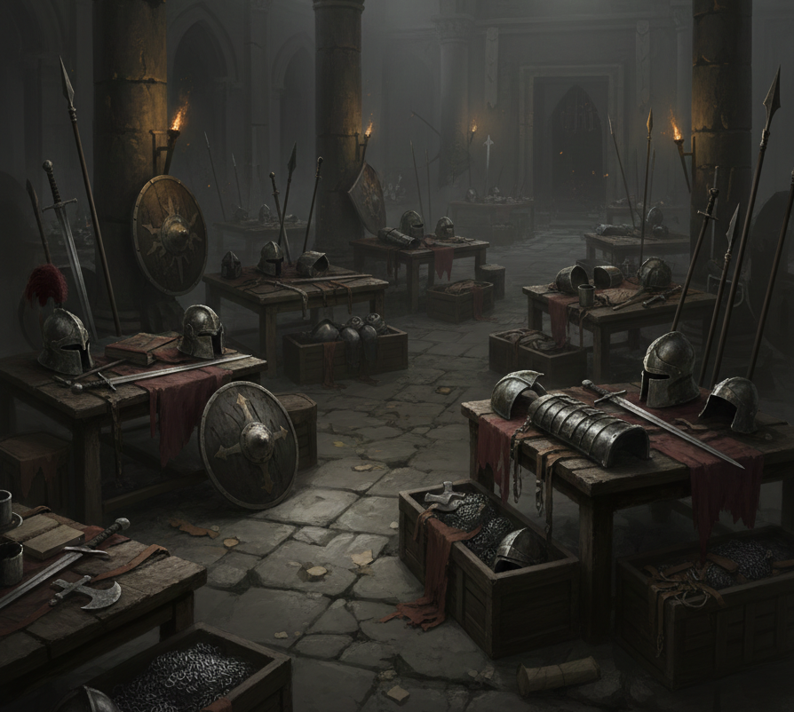

| Name              | Damage | Cost  | Req    | Notes                                                            |
| :---------------- | :----: | :---- | :----- | :--------------------------------------------------------------- |
| Fist              |   2    | -     | -      | -                                                                |
| Dagger            |   4    | 15sp  | AGI>50 | -                                                                |
| Sling             |   4    | 5sp   | AGI>40 | Range 20m. Uses stones (free).                                   |
| Short Sword       |   5    | 40sp  | AGI>40 | -                                                                |
| Long Sword        |   7    | 75sp  | STR>50 | -                                                                |
| Bastard Sword     |   8    | 120sp | STR>50 | -                                                                |
| Falchion          |   8    | 60sp  | STR>55 | Brutal: +1 damage on critical success.                       |
| Great Sword       |   10   | 250sp | STR>65 | -                                                                |
| Hand Axe          |   6    | 30sp  | STR>50 | -                                                                |
| Great Axe         |   11   | 220sp | STR>65 | -                                                                |
| Short Spear       |   7    | 50sp  | STR>50 | -                                                                |
| Pike              |   8    | 90sp  | STR>60 | Reach: Can attack enemies up to 3m away.                     |
| Mace              |   6    | 60sp  | STR>50 | -                                                                |
| Morning Star      |   7    | 80sp  | STR>55 | Spiked: Ignores 1 point of armor defense.                    |
| Warhammer         |   7    | 70sp  | STR>60 | Crushing: Ignores 1 point of shield defense.                 |
| Short Bow         |   6    | 80sp  | AGI>50 | -                                                                |
| Long Bow          |   8    | 150sp | AGI>50 | -                                                                |
| Crossbow          |   8    | 200sp | STR>55 | -                                                                |
| Weighted Net      |   -    | 20sp  | AGI>50 | Entangle: Hit targets are restrained.                        |
| Caltrops          |   -    | 10sp  | -      | Area Denial: Covers 2m sq. AGI check or 2 dmg + immobilized. |

### Armor

Armor protects you by providing **Defense**, a flat reduction value subtracted from incoming damage. Armors are categorized by weight, which determines the penalties applied to the wearer.

| Type             | Defense |  Cost  | Req    | Notes                                                              |
| :--------------- | :-----: | :----: | :----- | :----------------------------------------------------------------- |
| Light Armor      |         |        |        |                                                                    |
| Clothes          |    0    |   -    | -      | -                                                                  |
| Gambeson         |    1    |  50sp  | -      | Thick quilted cloth. Can be worn under other armor for +1 (Max 3). |
| Fur-Lined Garb   |    0    |  40sp  | -      | Advantage on checks vs cold.                                       |
| Thick Fabric     |    1    |  30sp  | -      | -                                                                  |
| Leather          |    1    |  80sp  | -      | -                                                                  |
| Studded Leather  |    1    | 200sp  | -      | -                                                                  |
| Medium Armor     |         |        |        |                                                                    |
| Hide Armor       |    1    | 120sp  | STR>40 | -                                                                  |
| Ring Mail        |    2    | 250sp  | STR>45 | -                                                                  |
| Scale Mail       |    2    | 450sp  | STR>50 | -                                                                  |
| Brigandine       |    2    | 650sp  | STR>55 | -                                                                  |
| Heavy Armor      |         |        |        |                                                                    |
| Chain Mail       |    2    | 300sp  | STR>50 | -                                                                  |
| Lamellar Armor   |    3    | 700sp  | STR>65 | -                                                                  |
| Plate Armor      |    3    | 800sp  | STR>70 | -                                                                  |
| Master-crafted Plate |    4    | 2000sp | STR>80 | -                                                                  |

### Helmets & Accessories

| Type                   | Defense | Cost  | Req    | Notes                                           |
| :--------------------- | :-----: | :---: | :----- | :---------------------------------------------- |
| Open Helmet            |   +1    | 60sp  | -      | Protects the head. Penalty: -5 to perception.   |
| Full Great Helm        |   +2    | 200sp | STR>60 | Maximum protection. Penalty: -15 to perception. |
| Reinforced Greaves     |   +0    | 80sp  | -      | Advantage vs leg-based "crippled" effects.      |

### Shields

Shields provide Defense and are used with the Block reaction.

| Type                   | Defense | Requirement | Cost  | Notes                              |
| :--------------------- | :-----: | :---------- | :---: | :--------------------------------- |
| Wicker Shield          |    1    | -           | 10sp  | Cheap and fragile.                 |
| Buckler                |    1    | STR > 30    | 25sp  | Small, easy to carry.              |
| Small Round Shield     |    1    | STR > 40    | 40sp  | Standard light shield.             |
| Round Shield           |    2    | STR > 55    | 100sp | Reliable protection.               |
| Square Shield          |    2    | STR > 60    | 120sp | Covers more of the body.           |
| Kite Shield            |    3    | STR > 65    | 180sp | Almond-shaped, excellent coverage. |
| Metal Shield           |    3    | STR > 70    | 250sp | Very durable.                      |
| Tower Shield           |    4    | STR > 80    | 500sp | Massive. Disadvantage on stealth.  |
| Iron-Hold Greatshield  |    4    | STR > 85    | 800sp | Master-crafted stone/metal hybrid. |

### Adventuring Gear
| Item                    | Cost  | Weight/Notes                                                |
| :---------------------- | :---: | :---------------------------------------------------------- |
| Torch (x3)              |  1sp  | Burns for 1 hour.                                           |
| Lantern                 | 10sp  | Requires Oil.                                               |
| Flask of Oil            |  2sp  | Burns for 4 hours.                                          |
| Rope (15m)              |  5sp  | Hemp.                                                       |
| Grappling Hook          | 15sp  | Attaches to rope. Advantage on climbing checks.             |
| Iron Spikes (x10)       |  2sp  | For climbing or jamming doors.                              |
| Crowbar                 | 10sp  | Advantage on STR checks to pry objects.                     |
| Rations (1 day)         |  2sp  | Dried meat/bread.                                           |
| Waterskin               |  1sp  | Holds 2 liters.                                             |
| Bedroll                 |  2sp  | For sleeping in the wild.                                   |
| Tinderbox               |  2sp  | Used to light fires.                                        |
| Iron Pot                | 10sp  | For cooking and boiling water.                              |
| Whetstone               |  5sp  | Use during rest. Adds +1 to the next damage roll.           |
| Clean Bandages (x5)     |  5sp  | Required for Medicine checks without penalty.               |
| Needle & Thread         |  2sp  | Repair gear or stitch wounds (medicine advantage).          |
| Manacles (Iron)         | 30sp  | Restrains a character. Requires key or hard thievery check. |
| Holy Water              | 50sp  | Deals 1d10 dmg to undead/demons.                            |

### Alchemical & Herbal Items

| Item                  | Cost  | Effect                                                                                                  |
| :-------------------- | :---: | :------------------------------------------------------------------------------------------------------ |
| North-Burn            | 10sp  | Flask of rough spirits. **Drink**: Advantage on Pain checks (1hr). **Sterilize**: Removes Sanitation penalty. **Weaponize**: If combined with a rag/bandage and lit (1 AP), it can be thrown (AGI check). On hit, deals 3 damage and applies **Burning** to target and units within 1m. |
| Weapon Oil            | 10sp  | Applied to metal gear. Prevents rust for 24 hours in wet conditions.                                    |
| Blood-Stanch Herb     | 15sp  | A bitter paste. Immediately stops the bleeding status.                                              |
| Numbing Mash          | 20sp  | A herbal chew. Ignore penalties from 1 level of exhaustion for 1 hour.                              |
| Troll Fat Candle      |  5sp  | Burns for 6 hours. Waterproof; stays lit in rain or snow.                                               |
| Stilling-Dust         | 40sp  | Potent narcotic. Removes fear and pain (ignore 2 levels of exhaustion), but causes -10 LOG for 4 hours. |

### Relics & Curios

In the world of Eda, special items are rare and often carry a price—either in coin or in the toll they take on the soul.

| Item                     | Effect                                                          | Lore/Note                                                       |
| :----------------------- | :-------------------------------------------------------------- | :-------------------------------------------------------------- |
| Amulet of Clarity        | Advantage on checks to resist fear.                             | Wearer takes 1 damage per hour as the stone siphons corruption. |
| Blood-Stained Dagger     | Deals +5 damage against enemies already below max HP.           | A relic from the "Bleeding Land" campaign.                      |
| Shadow-Veil Cloak        | Advantage on stealth checks in dim light or darkness.           | While worn, the user feels a cold dread (-5 to INS checks).     |
| Silver-Bell              | Rings softly when undead or demons are within 20m.              | Blessed by the Zealots of the Sun.                              |
| Cold-Iron Shackles       | Prevents the use of spells and rituals by anyone bound in them. | Used by witch-hunters to transport prisoners.                   |
| Marrow-Bone Flute        | Using the Perform skill grants +5 IP to an ally (1/day).    | Carved from the bone of a forgotten saint.                      |
| Void-Glass Lens          | Allows the user to see invisible spirits and magic auras.       | Extensive use causes temporary blindness (1d10 hours).          |
| Vanguard Bracers         | Your first attack in a combat encounter has advantage.      | Emblazoned with the crest of the High Vanguard.                 |
| Duelist's Cape           | Gain +1 Reaction pool while not wearing heavy armor.        | A swirling silk cape designed to confuse opponents.             |

### Folk Curios & Occult Ingredients

In the shadowed corners of Eda, practitioners of the old ways utilize macabre components to tether their magic to the physical realm. These items are rarely found in shops, often requiring desecration or dangerous harvesting.

| Item                     | Mechanical Effect & Occult Significance                                                                                 |
| :----------------------- | :---------------------------------------------------------------------------------------------------------------------- |
| Elf Stone / Elf Shot     | Ancient flint arrowheads. Grants +5 defense vs ranged attacks and protection against fey curses.                    |
| Desecrated Remains       | The small skeletons of the unbaptized. Grants advantage on occult knowledge checks when communing with spirits.     |
| Bone Knots               | Finger bones tied with sinew. Grants advantage on thievery (lockpicking) checks as they "whisper" to the mechanism. |
| Sacrificial Blood        | Collected during a lunar event. Restores 1 IP if used as a component in a ritual.                                   |
| Hanging Torso            | A preserved human torso. Grants advantage on intimidate checks; its presence unsettles the living.                  |
| Amber Resin              | Warm to the touch. Grants advantage on medicine checks, specifically related to childbirth or vitality.             |
| Obsidian Glass           | Sharp and cold. Used to trap minor spirits; grants advantage on INS checks to resist ghosts.                        |
| Hazel Dowsing Rods       | Naturally attuned to water and metal. Grants advantage on navigation when searching for resources.                  |
| Tanned Human Skin        | Pliable and etched with runes. Grants advantage on spell craft when used as parchment.                                |
| Oiled Severed Head       | Preserved in rare salts. Required for the *Talk with Dead* ritual; grants a more compliant spirit.                      |
| Eclipse Hair             | Shorn from a victim during a lunar eclipse. A necessary component for high-tier curses.                                 |
| Hallowed Grave Soil      | Soil taken from a master craftsman's grave. Grants advantage on *animate plant* or *animate object* rituals.        |
| Cold Iron                | Unworked iron. Deals 1d10 damage to fey creatures and prevents them from entering a warded circle.                  |
| Etched Skulls            | Skulls of scholars or warriors. Requirement for the *Talk with Dead* ritual.                                            |
| Cinerary Ash             | The remains of a powerful witch or warlock. Acts as a potent component for necromancy rituals.                          |
| Vitriol Mucus            | Extracted from venomous beasts. Grants advantage on alchemy when brewing lethal poisons.                            |
| Ancient Mirror           | A tarnished, silvered mirror. Reflects curses back at the caster (advantage on resistance checks).                      |
| Sulfur Salts             | Stinking yellow powder. Deters insects and low-tier demons; grants advantage on survival.                           |
| Warded Rowan Sticks      | Bound with red thread. Grants advantage on INS checks to resist or detect incoming magic.                           |
| Silver Filigree          | Pure silver shavings. Deals 1d10 damage to lycanthropes and wards against their presence.                           |
| Eagle Stone              | A hollow geode found in high nests. Grants advantage on perception when used as a focus.                            |

## Magic & Rituals

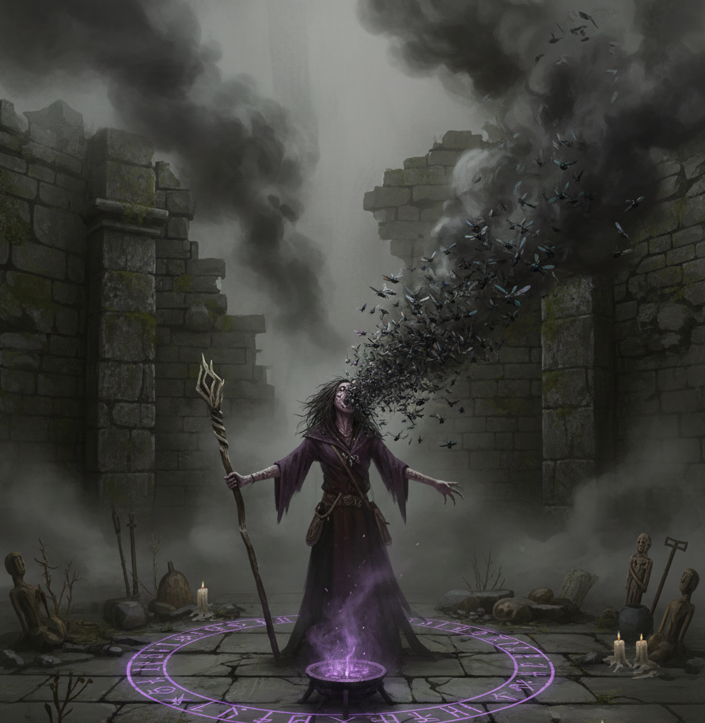

Magic in Eda is a gnarly, dangerous practice that draws power from the subconscious and the darker corners of the world. It is a strategic gamble; because characters have limited Instinct Points (IP) and magic takes a physical toll, most practitioners must rely on their mundane skills and weapons until a situation becomes desperate.

### Spells

All spells require a successful **INS check** (including the required DoS). Combat magic focuses on visceral effects and immediate conditions.

| Name | IP | Difficulty | Description & Effect |
| :--- | :--- | :--- | :--- |
| **Blight** | 5 | Routine (1 DoS) | You exhale a cloud of flies and bile. **Cone (3m). Target takes 5 + DoS damage and the Poisoned condition.** |
| **Veil of Blood** | 5 | Routine (1 DoS) | You slice your palm and blow the droplets into a fine, red fog. **5m Area. Anyone inside takes the Bleeding condition.** |
| **Vomit Fire** | 10 | Challenge (2 DoS) | You swallow a coal; your ribs glow before you vomit a ball of flame. **8 + DoS Fire Damage + Burning condition.** |
| **Clay Grasp** | 5 | Routine (1 DoS) | You whisper to the earth; clay hands rise to seize the ankles of your foe. **Target is Immobilized + Restrained.** |
| **Salt Statue** | 10 | Challenge (2 DoS) | You blow white dust at a foe; their skin hardens into cracked salt. **Target is Stunned for 1 round.** |
| **Pluck the Eye** | 5 | Routine (1 DoS) | You make a hooking motion in the air; the target's eyes roll back into their head. **Target is Blinded for 1 round.** |
| **The Knot** | 5 | Routine (1 DoS) | You twist a rag in your hands; the target's bowels knot in agony. **Target is knocked Prone and takes 3 + DoS damage.** |
| **Witch Wall** | 5 | Routine (1 DoS) | You weave your fingers in a pattern that blurs your physical form. **Caster gains Evasive status.** |
| **Crow Senses** | 5 | Routine (1 DoS) | You coat your eyes in crow-fat to blend into the dark. **Caster gains Hidden condition in shadows.** |

### Rituals
Rituals are powerful, utility-focused magical operations that cannot be cast in combat. They require a prepared space, specific ingredients, and significant time.

### Ritual Rules

*   Requirements: Must have the Rituals (T2) Witch Talent.
*   Time: 1 Hour (Standard).
*   Cost: 10 IP + Material Cost (Gold/Ingredients).
*   Check: Roll INS vs difficulty (DoS). Most standard rituals require 1 DoS (routine). Powerful rituals may require 2-4 DoS.

#### Ritual Outcomes

*   Success: The ritual works as intended.
*   Critical success (pair under skill): No IP cost, and the effect is doubled or enhanced.
*   Failure: No effect. Lose IP and materials. Lose 2 additional IP due to fear.
*   Critical failure (roll 95-100): The ritual backfires. The GM determines a negative consequence. Lose 5 additional IP due to fear.

### Ritual List

| Name | Time | IP | Materials | Description & Effect |
| :--- | :--- | :--- | :--- | :--- |
| **Animate Mud** | 2h | 15 | Heart of a warrior (Fresh) | You stitch a still-warm heart into a mound of river-clay. **Creates a Mud Golem (HP 30, Defense 2, STR 60) for 24h.** |
| **Consume Soul** | 1h | 20 | A child's lock of hair | You burn a lock of innocent hair and inhale the smoke, feeling their potential fuel you. **Gain Advantage on all checks for one attribute for 24h.** |
| **Dead Tongue** | 1h | 10 | The skull of the deceased | You drip hot wax into the ear-holes of a skull to hear its whispers. **Ask 3 questions. Spirit is vengeful.** |
| **Wither** | 1h | 10 | Blind man's tears | You sprinkle tears over a field; the grain turns to black rot by dawn. **Destroys a field's harvest.** |
| **The Grand Curse** | 4h | 30 | A small child's arm | You bury the limb beneath the target's threshold while whispering their name. **Target gains 1 level of Exhaustion every day (permanent).** |
| **Blood Reading** | 1h | 10 | 1 HP from caster | You taste your own blood after touching a relic, seeing flashes of its past. **Identify the properties and history of a magical object.** |
| **Cleanse** | 1h | 10 | Pure spring water | You wash the target in water from a mountain's eye to peel away the filth. **Removes one curse or 1 level of exhaustion.** |
| **Mirror Visions** | 1h | 15 | Silvered mirror (20sp) | You stare into the glass until it reflects things that haven't happened. **Gain Advantage on your next 3 initiative rolls.** |
| **Dimension Gateway** | 4h | 25 | Star Dust (50sp) | You tear a hole in reality between two known circles. **Portal remains open for 1 hour.** |
| **Summon Serpent** | 10m | 10 | Snake Skin | You whistle through a hollowed snake-skin. **Summons a Giant Snake (Creature Compendium) for 1 hour.** |

## Game Master Section

### Progress Clocks

Progress clocks are a visual tool used by the game master to track the flow of events, the progress of a complex task, or the approaching threat of a looming danger.

A clock is a circle divided into segments—typically 4, 6, or 8. As events unfold, the GM fills in these segments to represent progress.

### Types of Clocks

*   Objective Clocks: Used to track the players' progress toward a goal, such as "Sneak into the Fortress" or "Research the Ancient Curse."
*   Danger Clocks: Represent a growing threat or a countdown to a negative event, such as "The Guards are Alerted" or "The Ritual Completes."
*   Linked Clocks: Sometimes, one clock must be completed before another can begin. For example, a "Find the Secret Entrance" (4 segments) clock might need to be filled before the "Infiltrate the Vault" (6 segments) clock starts.
*   Mission Clocks: Track the overall progress of a large-scale operation or adventure.

### Filling a Clock

Segments are usually filled based on the outcome of rolls:

*   Success: Fill 1 segment.
*   Critical success: Fill 2 or 3 segments.
*   Failure on a risky action: The GM may fill 1 or 2 segments on a related danger clock.

### Why Use Clocks?

Clocks provide transparency and tension. They allow players to see exactly how close they are to success or disaster, making their choices feel more impactful. They are especially useful for situations that shouldn't be resolved by a single roll but require a series of actions.

### Running the Game

This section provides concrete guidance for managing the challenges of Eda at the table.

### Handling Lethality & Success

Eda is a dangerous world. Success is never guaranteed, and failure should always carry weight.

#### The Cost of Failure
Avoid "nothing happens" on a failed roll. Instead, introduce a concrete consequence:

*   Strength Failure: You force the door open, but your shoulder is bruised (Lose 1d10 HP) or your crowbar snaps.
*   Logic Failure: You decipher the map, but it takes so long that the sun sets, consuming time and light resources.
*   Agility Failure: You sneak past the guard, but drop a pouch of 5 sp that clatters on the stone.

#### Success with a Cost
Sometimes a player fails a roll by a small margin. You can offer them the choice to succeed at a cost.

*   *Example*: "You catch the ledge, but the strain costs you 5 IP as panic sets in."

#### Theater of the Mind & Tactical Combat

In Eda, you can resolve encounters using either Theater of the Mind or tactical maps. Theater of the Mind (TotM) relies on narrative descriptions and is often the best choice for social encounters, travel, or quick skirmishes where precise positioning isn't critical. It keeps the story moving and allows for high flexibility.

However, because of the depth of Eda’s mechanical systems, **Combat** is usually more satisfying and clear when handled **tactically** with a grid or map. It is ultimately up to the GM and the players to choose the style that fits the current scene best.

**Benefits of Tactical Combat:**
- **Precision of Movement**: Features like *Evasive Stance* (moving 3m+) and specific weapon reaches (like *Pikes* with 3m reach) are much easier to adjudicate when distances are concrete.
- **Resource Management**: The *Reaction Pool* is a finite resource. Seeing exactly how many enemies can reach you allows players to make better strategic gambles on when to Dodge, Parry, or Block.
- **Cover and Positioning**: Tactical maps remove disputes about whether a character has *Half* or *Full Cover* or if they are successfully *Flanking* an opponent.
- **Battlefield Control**: Talents that affect areas or multiple targets are more impactful when the spatial relationships between combatants are visible.

> #### GM Tip: Tracking Bleeding
> Because damaging hits inflicts the **Bleeding** condition, keeping track of it for multiple NPCs and PCs can become a chore. 
> 
> Use physical markers—such as red plastic rings, small red dice, or red translucent tokens—and place them directly on or next to the miniature on the map. This provides an immediate visual cue of who is losing blood.

### Practical Rules Application

*   The Art of the Roll: Only call for a roll when:
    1.  The character is under pressure (time, danger, or social stakes).
    2.  The outcome is uncertain.
    3.  Failure has a concrete consequence.
*   Narrating degrees of success (DoS): Use the DoS to describe the quality of the action:
    *   1 DoS (Routine): You get the job done, but it’s messy or takes effort.
    *   4 DoS (Hard): You perform the task with professional grace and efficiency.
    *   8 DoS (Near Impossible): You perform a legendary feat that leaves witnesses in awe.

## Progression

The progression system in Eda rewards failure and provides consistent growth, ensuring low skills improve quickly while high skills plateau.

### The Fumble Points

*   Trigger: Your skill improves immediately when you roll a Critical Fumble.
*   Definition of Critical Fumble:
    1. Rolling a pair (11, 22, 33, ..., 00) that is ABOVE your skill value.
    
        *   *Example*: Skill 45. Roll 77. (Fail + pair) -> fumble. Skill increases to 46.
*   The Reward: When you Fumble, increase that skill by 1 point permanently. This represents learning from a spectacular failure.

### Milestones & Growth

After every major encounter, significant discovery, or successful completion of a goal, the GM awards players 2–5 Experience Points (XP). As a general rule, players should receive about 5 XP for every day of active adventuring.

**Spending XP:**

*   Buy Talents: T1 = 5 XP, T2 = 10 XP, T3 = 15 XP, T4 = 20 XP.
*   Increase attributes: +1 to any attribute = 10 XP.
*   Steady Training: 1 XP increases a trained skill score by 1 point.
*   Unlock Skill: 5 XP to turn an untrained skill into a trained skill.
