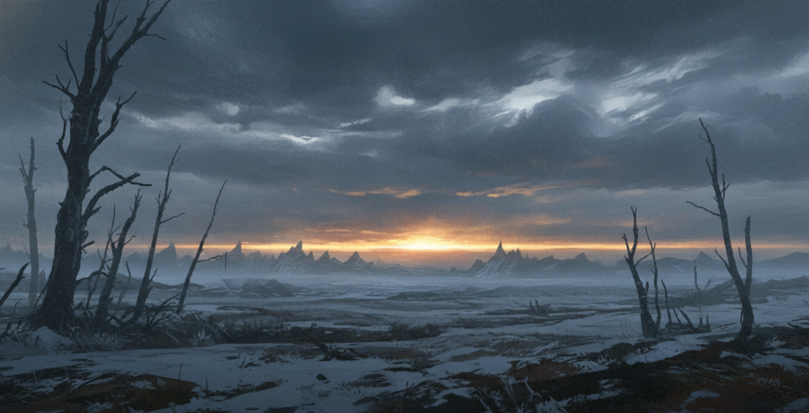

# World of Eda: Game Master's Tome

*This book is intended for Game Masters only. It contains secrets, mechanics, and world-building details that players should discover through play.*

---

## Introduction

The planet maybe also was named Eda if the people living in it would know, but most didn't. For all they knew the world was flat and most of them didn't have time to think about that anyhow. Eda had been around for a couple billion of years. First there was violence, giant storms roamed the planet for millions of years, then volcanos. After the volcanos had spewed out their lava and created the landmasses. Continents formed. Men had been around for maybe 400000 years, grown out of the dying giants. 
The name Eda was from the enlightened time. 25000 years ago. 
The game is in year 423 after Korint, king of kings. Who only changed the calendar again. As many kings done before him. 

roughly 20000 years ago, 25-20000 years ago was the the age of wonder. Where the name Eda comes from. Not anyone really know this but at that time, the land was mostly in peace and people was prosperous. Until a disease came and wiped out 95% of all people within a year. Dark plague that caused peoples body to get warts that after a while exploded with puss. It was a horrible mass extinction event i.e.,. All memory of that time is forgotten, any artifacts still laying in the ground somewho wear is very few if any. There are religions that formed after this by stories, that talks about mass diseases and these religious people who wear masks still until this day and washes their hands 5 times a day. They have however mixed in some gods that did not have part if the event. 

## Gods
Gods are long dead real people, giants and titans that roamed the world long ago. Some older time and some younger time. Any memories of them or their will only live in the ether. 

## The ether.
The planet of Eda is caught between two suns. This have caused a small radiation belt through the planet that is the source of magic, and acts like a persistent memory layer and spirit land. In a sense capturing all thoughts outside of time.

## The Dying Breath of Eda
### The Tone of the World
### Themes: Survival, Scarcity, and the Creeping Void
### How to Use This Tome

---

## Part I: The Master of Worlds (Lore & Cosmology)

### Chapter 1: The Mythos of Eda

#### The Golden Void: Before Time and Light
In the beginning, there was no matter, only the **Golden Void**—a sea of infinite potential and screaming light. It was a realm of pure thought who wear the concept of "gravity" or "death" did not yet exist. This was the home of the **Titans**, beings made of pure radiation and will, who danced in the light of the first sun.

#### The First Silence and the Awakening of the Gods
The Mythos tells of the **First Silence**, a moment when the light of the Golden Void flickered. From the shadows of that flicker, the **Old Night** was born—a hunger that sought to consume the light. To survive, the Titans had to manifest; they had to become "real." This transition from pure thought to physical matter was the **Awakening**. The Titans grew heavy, their bodies forming the first stones, gases, and liquids.

#### The Creation of Eda (The Wondrous)
Eda was not "built"; it was the result of a great collision. Two massive Titans, whose names are forgotten, locked in an eternal embrace to shield a pocket of the Golden Void from the encroaching Old Night. Their bodies fused, their blood became the oceans, and their dying breaths became the atmosphere. This planet—Eda—is a living sarcophagus. The radiation belt that circles it is the lingering heat of that ancient collision, now known as the **Ether**.

#### The Imprisonment of the Old Night
The Old Night was not defeated, merely locked away. The core of Eda is said to be a "Cracked Prison" who wear the strongest shards of the Night are kept in check by the planet's internal heat. As the twin suns dim and the world cools, the prison grows brittle. The **Long Winter** is not just a weather pattern; it is the Old Night slowly breathing through the cracks in the world.

### Chapter 2: The Old Night & The Great Shattering

#### The Nature of the Void: A Lack of Existence
#### The Shards of the Night
#### The Breaking of the High Barrow
#### The Long Winter: A World Without a Sun

The twin suns that once bathed Eda in golden light are dying. This is not metaphor—they are literally fading, their fires dimming with each passing century. The radiation belt that powers of Ether is weakening, and with it, the barrier that holds back to Void grows brittle.

The Long Winter is the result. It began slowly, so gradually that few noticed at first. But over the past thousand years, winters have grown longer and harsher. The summers have grown shorter and cooler. Crops fail more often. Livestock dies in the fields. The seas freeze further from shore each year.

But the Long Winter is more than just cold. It is the Old Night breathing through the cracks.

As the suns dim and the barrier weakens, the Void's influence grows. The winters are longer because the Void is literally drawing the heat out of the world. The cold is not natural—it is supernatural, a manifestation of the Void's hunger reaching out to consume the warmth of life.

The Long Winter affects different regions differently. In the Fjordlands, the winters are brutal but survivable with proper preparation. In the deep north, where the Ashen Seers make their home, the cold is so extreme that it freezes the very air. In the Whispering Woods, the winter brings strange phenomena—trees that move when no one is watching, lights that appear in the forest and lead travelers to their doom.

Most scholars believe that the Long Winter will not end until the twin suns finally die. When that happens, the Void will be free to consume Eda completely. The world will end not with fire or ice, but with a simple cessation of existence.

This is the stakes that the current era faces. Every winter is potentially the last. Every year that passes is one year closer to the end. This is why the Iron Covenant seeks to conquer and control, why the Ashen Seers seek to transcend their humanity, why desperate peoples cling to any hope of salvation.

The Long Winter is not just weather—it is a countdown to extinction.

### Chapter 3: The Demons (The Fell & The Urgudar)

#### The Hierarchy of Terrors
#### Singular Entities: Dagon, Hydra, and the Great Names
#### The Process of Possession and Corruption
#### The Silent Whispers: Demonology and Forbidden Research

### Chapter 4: The Divine & The Faiths

#### The Silent Gods: Fragments of Memory
The gods of Eda are not celestial beings in the traditional sense. They are the **Urgudar**—the first giants and titans who walked the earth when it was still molten. Their bodies form the bedrock of the continents, and their dying thoughts permeate the ether.

#### The Order of the Veiled Breath (The Masked ones)
The most prominent religion in the Fjordlands, the **Order of the Veiled Breath**, was born from the trauma of the **Dark Plague**. They believe that the plague was a physical manifestation of "impurity" leaked from the **Old Night**.

*   **The Mask**: Members are never seen in public without a mask. These masks are often carved from the bone of ancestors or forged from cold iron. They serve as a filter, both physical and spiritual, to keep the "breath of the void" at bay. To show one's face to a stranger is considered a grave sin and a biological risk.
*   **The Five Washings**: Devout followers wash their hands, face, and feet with a mixture of salt and lye five times a day: at dawn, mid-morning, noon, mid-afternoon, and dusk. These rituals are performed with surgical precision.
*   **The Pantheon of Purity**: They have mixed the names of ancient titans with the "Saints of the Plague."
    *   **Saint Valerius**: Often depicted with a bird-like mask, he is the patron of medicine and "the clean cut."
    *   **The Mother of Ash**: A titan whose volcanic body provides the lye used in their purifications.

#### The Iron Covenant: Tyranny in the Name of Order
A militant sect that follows the teachings of **Korint**. They believe that only through absolute iron rule can humanity survive the Long Winter. They view magic as a chaotic infection that must be contained or "cauterized." They are known for their massive iron citadels and their "Inquisitors" who hunt those touched by the void.

#### The Ashen Seers: Purification through Frost
Found primarily in the deep north, these mystics believe that the **Long Winter** is a cleansing fire of ice. They walk naked through the snow, their skin turned blue and leathery by the cold. They seek to "freeze" their thoughts to match the stillness of the dead gods in the ether.

#### The Church of the Sun-Bringer: A Flickering Flame
A dying faith that clings to the hope that the twin suns will one day return to their full glory. They maintain "Ever-Fires" in small villages, providing the only warmth against the encroaching dark. They are often targets of the Iron Covenant, who view their optimism as a dangerous delusion.

#### Secret Cults and Void-Worshippers (The Quiet Ones)
In the shadows of the great ruins, some have begun to worship the **Old Night** itself. They believe that survival is impossible and that the only mercy is to hasten the end. They speak in whispers and are said to be able to "un-make" objects and people by tapping into the lack of existence.

### Chapter 5: The History of the Wolf-Age

#### The Era of Prosperity (The Golden Age)
The **Age of Wonder**, occurring between 25,000 and 20,000 years ago, represents the zenith of human civilization on Eda. During this time, the "giants" were not yet distant myths but active, though slumbering, presences in the landscape. The name **Eda**, meaning "Wondrous" in the High Tongue, was coined to describe a world who wear the ether was calm and magic was a tool for creation rather than a source of corruption.

Great spires of white stone and "thought-glass" rose above the forests, linked by bridges of pure light. There was no hunger, as the radiation from the twin suns was harnessed to feed the soil and the soul alike. This was the era of the **First Enlightened**, who understood the world was a sphere caught in a celestial dance.

#### The First Frost: The Warning Signs
The end of the Golden Age did not begin with a bang, but with a cough. A subtle shift in the radiation belt—the ether—caused the first "thinning." The giants, whose decaying bodies formed the mountains and valleys, began to stir in their eternal sleep. The warmth of the twin suns seemed to dim, and the first recorded frosts appeared in the tropical belts. 

#### The Dark Plague (The Great Extinction)
Roughly 20,000 years ago, the **Pustule Plague** (or the **Dark Plague**) struck. It was a biological catastrophe without precedent. Within a single year, 95% of the global population perished. 

The disease manifested as hard, black warts that formed in clusters around the joints and throat. These warts would eventually engorge with a toxic, grey puss and explode, spreading the infection to anyone nearby. It was not merely a physical ailment; it was an "etheric rot" that erased the memories of the dying, ensuring that the knowledge of the Age of Wonder died with its victims.

#### The Age of Wolves: The Collapse of Empires
In the vacuum left by the plague, the survivors descended into savagery. This 19,000-year gap is known as the **Silent Era** or the **Age of Wolves**. Humanity forgot how to read, how to forge "thought-glass," and how to live in peace. Small tribes fought over the rusted scraps of the giants' armor. The world became a place of scarcity and fear, who wear the only law was the blade and the wolf.

#### The Current Era: The Last Stand of Humanity
The modern calendar begins with **Korint, King of Kings**. 423 years ago, Korint united the fractured Fjordlands and the scattered southern tribes under a single, bloody banner. He was a man of immense ambition who sought to reclaim the title of "God" for humanity. He reset the calendar to mark his coronation, declaring the "Rebirth of Eda."

However, Korint's empire lasted only as long as he did. Upon his death, his sons tore the kingdom apart, leading to the current state of fragmented city-states like **Oakhaven** and the **Iron Hold**. Today, the **Long Winter** has truly begun; the suns grow colder, and the void between them grows wider. Humanity is no longer building; it is merely trying to avoid the final breath.

---

## Part II: The Occult & The Arcane

### Chapter 6: The Philosophy of Magic

#### Magic as an All-Permeating Force
#### The Cost of Mastery: Sacrifice and Scars

### Chapter 7: Biological Occultism

#### The Power of Vital Fluids (Urine, Spit, Blood)
In Eda, magic is not merely a mental exercise; it is a physical extraction. The ether interacts most strongly with liquids that carry the "life-spark."
*   **Blood**: The most potent and dangerous. Blood magic can tear the veil between worlds, but it attracts the **Urgudar** (spirits of the titans).
*   **Spit & Urine**: Used in low-level charms and "warding." The **Masked Ones** often use their own spit to activate the lye-filters in their masks.

#### Bone Magic and the Relics of the Dead
Because humans grew from the giants, their bones contain "echoes" of ancient power. Carving runes into the bone of a deceased ancestor allows a practitioner to tap into that ancestor's memory-trace in the ether. This is why the **Order of the Veiled Breath** carves their masks from bone; it is a literal "memory-filter."

#### Sex Magic: The Little Death and Spirit Invocation
The act of procreation creates a temporary "surge" in the local ether. Occultists use this moment of "The Little Death" to summon spirits or to "anchor" a thought into the persistent memory layer of the planet. It is highly taboo in civilized areas like **Oakhaven** but practiced openly by the **Ashen Seers**.

### Chapter 8: Rituals & Iron Signs
#### Decoding the Omens: The Language of the Gods
#### Great Feasts and the Thinning of the Veil (Midwinter, Equinox)
#### Oaths, Curses, and the Weight of the Word

---

## Part III: The Gazetteer (The Known World)

### Chapter 9: The Fjordlands

The Fjordlands are the bruised knuckles of Eda—a series of jagged, ice-choked inlets and granite cliffs that were once the literal "ribs" of a fallen titan. It is a land of verticality and salt-spray, who wear the only thing more dangerous than the terrain is the weather.

#### Oakhaven: The Last Ember

Oakhaven is a settlement built within the hollowed-out skull of a minor giant. The "Oak" for which it is named is a massive, petrified tree that grows from the giant's eye-socket, its roots reaching deep into the ether-veins. It is one of the few places who wear the **Order of the Veiled Breath** and the **Iron Covenant** exist in a tense, cold peace. The city's fires are maintained by the **Sun-Bringers**, who are tolerated only because they keep the frost-ghouls at bay.

#### The High Barrow: The Cracked Prison
Located on the highest peak of the Fjordlands, the High Barrow is an ancient structure of "thought-glass" and iron. It is believed to be the primary seal for a shard of the **Old Night**. The air around the Barrow is so thin and cold that breath turns to ice instantly, and the ether screams with the whispers of the imprisoned.

#### The Iron Hold: The Mountain of Despair
The seat of the **Iron Covenant**. It is a fortress carved directly into a mountain of pure magnetite. The magnetic fields here are so strong they interfere with the ether, making magic nearly impossible to cast but providing a natural defense against the void-entities. The Covenant uses this "dead zone" to train their inquisitors.

### Chapter 10: The Whispering Woods

#### The Glass-Singers and the Echoes of the Dead
#### The Black Glass Labyrinth

### Chapter 11: The Underworld & The Hidden Realms

#### The Fairy Realms: The "Between"
#### The Trolls' Kingdoms: Deep Beneath the Ice
#### The Gates of the Void

---

## Part IV: The Master of Adventures (Running the Game)

### Chapter 12: Running a Dark Fantasy World
#### Managing Tension and Scarcity
#### Adjudicating the DoS System
#### Environmental Storytelling

### Chapter 13: NPCs & Factions
#### Creating Desperate Characters
#### Major Factions and Their Agendas (Curatores Lucis, Vitae Ordo)
#### Secret Societies: Societas Luxus and The Sisters

### Chapter 14: Adventure Hooks for a Dying World
#### Themes of Scarcity and Sacrifice
#### Non-Combat Challenges and Moral Dilemmas

---

## Part V: The Master of Rules (The Toolkit)

### Chapter 15: Survival in the Long Winter

#### Weather Systems & The Long Winter
#### Travel Segments & Exhaustion
#### Hunger, Thirst, and the Bitter Cold

### Chapter 16: Sanity & The Void's Influence
#### Seeing the Unseen: The Mental Toll
#### Corruption, Stains, and Physical Mutations

### Chapter 17: Random Tables & Generators
#### Wilderness Encounters (Social, Combat, Discovery)
#### Loot & Discovery (Common to Artifact)
#### Omen & Rumor Generators
#### NPC Name and Motivation Generator
