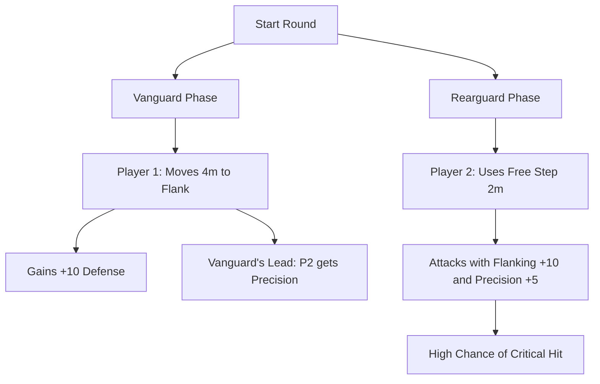

# Implementation Plan: Dynamic Movement & Tactical Battlefields (Approved)

## 1. The Core Problem
In the current 2-AP system, players often feel that moving (1 AP) is a "waste" because it sacrifices 50% of their offensive potential (one of two attacks). This leads to static "slugfests" where characters stand still and trade blows.

## 2. Structural Changes (Deferred for now)
The proposed "Step" (Zero-Cost) and "Core Flanking" rules are currently on hold to see how the other changes affect balance.

---

## 3. Movement Momentum: Rewards for Moving (Implemented)

To make spending 1 AP on movement feel rewarding, movement should provide a lingering benefit.

### A. Evasive Maneuver (Passive)
*   **Effect**: If you spend 1 AP to **Move** at least 3 meters, you gain **+10 to Active Defense rolls (Dodge/Parry/Block)** until the start of your next turn.
*   **Flavor**: You are a moving target, making it harder for enemies to track your vitals.

### B. The Charge (Action - 1 AP)
*   **Effect**: Move up to your Speed in a straight line and make a single melee attack.
*   **Bonus**: If you moved at least 3 meters, the attack deals **+5 Damage**. 
*   **Risk**: You cannot use the **Dodge** reaction until the start of your next turn (as you have committed your momentum forward).

---

## 4. Initiative-Based Synergies

Using the Vanguard/Rearguard phases to promote teamwork through movement.

### A. Talent: Vanguard's Lead (T1 - Common)
*   **Effect**: If you move at least 3 meters during the **Vanguard Phase**, you can designate one ally. That ally gains **Momentum (Precision)** for free when their turn arrives in the Rearguard.
*   **Philosophy**: Your aggressive movement creates openings or draws attention, helping your teammates.

### B. Talent: Pack Tactics (T2 - Huntsman/Thug)
*   **Effect**: If an ally is within 2m of your target and has already moved or acted this round, your attacks against that target gain **Advantage**.

---

## 5. Dynamic Battlefield Interactions

To move away from "I hit you," we need the environment to be a participant.

### A. Environment Interaction (Deferred)
New environmental actions (Topple, Distract, Hazards) are deferred for now.

### B. Directional Cover & Bypassing (Implemented)
Reinforce the rule that moving to the "side" of cover negates it. This forces shooters to move to get a clear shot and targets to move to stay protected.

---

## 6. Summary of Impact

| Action              | Current Value         | Proposed Value                              |
| :------------------ | :-------------------- | :------------------------------------------ |
| **Move (1 AP)**     | Change position only. | Change position + gain **+10 Defense**.     |
| **Attack (1 AP)**   | Deal damage.          | Deal damage + potential **Flanking** bonus. |
| **The Step (0 AP)** | N/A                   | Reposition 2m for free.                     |
| **Charge (1 AP)**   | N/A                   | Move + Attack with **+5 Damage**.           |

## 7. Speed Calibration
To make these 2m steps and 3m momentum triggers meaningful, the base movement speed needs to be calibrated.
*   **Proposed Speed Formula**: `Speed (m) = AGI / 10` (rounded down).
    *   *Example*: A character with 65 AGI has a Speed of 6m.
    *   *Armor Impact*: Chain Mail (-1m) reduces this to 5m. Plate Armor (-2m) to 4m.
*   This makes a 2m Step a significant tactical shift (about 33-50% of a move) without being overpowered.

---

## 8. Coordination Example

