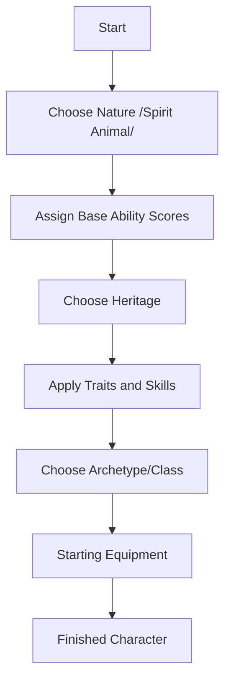

# Proposal: Thematic Renaming of "Genome"

## Overview
The current terminology "Genome" and its associated names (Strong Man, Brainiac, etc.) are too modern/scientific for the dark, Nordic fantasy setting of *The Age of Wolves*. This proposal replaces them with animal totems and thematic category names that better reflect the "Nature" or "Spirit" of a character.

## Category Renaming
**Current:** Genome  
**Proposed:** **Nature** (or **Blood-Mark** / **Spirit**)

*Note: "Nature" reflects the innate stat distribution as opposed to "Heritage" which reflects culture and ancestry.*

## Specific Name Mapping

| Current Name    | Primary Stat | Proposed Animal Totem | Thematic Rationale                                      |
| :-------------- | :----------- | :-------------------- | :------------------------------------------------------ |
| **Balanced**    | Equal (60s)  | **The Wolf**          | Balanced, social, and the central motif of the setting. |
| **Strong Man**  | STR (70)     | **The Bear**          | Raw physical power and dominance.                       |
| **Brainiac**    | INT (80)     | **The Raven**         | Cunning, wisdom, and association with the All-Father.   |
| **Rubber Duck** | AGI (70)     | **The Lynx**          | Swift, silent, and deadly agility.                      |
| **Introvert**   | MND (75)     | **The Owl**           | Deep focus, mental clarity, and night-vision.           |
| **Big Baby**    | CON (70)     | **The Ox**            | Unyielding endurance and physical sturdiness.           |
| **Prom Queen**  | CHA (70)     | **The Fox**           | Cleverness, social guile, and charm.                    |

## Implementation Strategy
1.  **Terminology Audit:** Search and replace "Genome" with "Nature" across the entire repository.
2.  **Stat Array Update:** Update the table in [`Core Rulebook.md`](Core Rulebook.md) with the new names.
3.  **Codebase Sync:** Update `combat_sim.py` to use the new identifiers (e.g., `nature="The Wolf"`).
4.  **Supporting Documents:** Update references in `Campaign_The_Age_of_Wolves.md`, `Character Sheet Template.md`, and various planning/audit files.

## Diagram: Character Creation Flow

