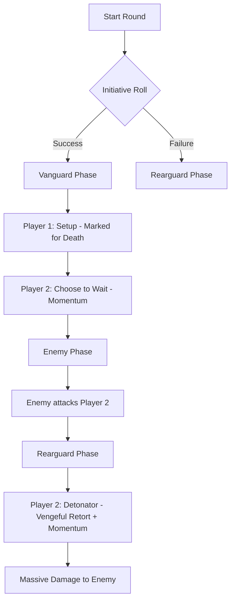

# Plan: Initiative-Driven Tactical Combat

## 1. The Core Philosophy
In Eda, combat is not just about raw power, but about **timing and coordination**. The initiative system allows players to act before (Vanguard) or after (Rearguard) the enemies. This plan introduces mechanics and talents that make this choice a deep tactical layer.

## 2. Initiative Framework: Vanguard & Rearguard

### The Initiative Roll
*   **Vanguard (Success)**: Acts before the enemies.
*   **Rearguard (Failure)**: Acts after the enemies.

### The "Wait" Mechanic (New)
Players in the **Vanguard** phase can spend **1 Action** to **Wait** and drop to the **Rearguard** phase.
*   **The Benefit of Waiting**: By observing the enemy's movement and surviving their initial onslaught, the player gains **Momentum**.
*   **Momentum Effect**: Choose one:
    *   **+10 to Hit** on the next attack.
    *   **+2 Damage Reduction (DR)** for the remainder of the round.
    *   **Advantage** on a specific skill check (e.g., Athletics to Shove).

---

## 3. Phase-Specific Talents
New talents that reward acting in specific phases.

| Talent Name         |   Phase   | Effect                                                                                      |
| :------------------ | :-------: | :------------------------------------------------------------------------------------------ |
| **First Strike**    | Vanguard  | Your first attack this round deals **+5 Damage**.                                           |
| **Tactical Guard**  | Vanguard  | You can spend 1 action to give an ally in the Rearguard **+10 to their next Defense roll**. |
| **Vengeful Retort** | Rearguard | If you took damage this round, your next attack has **Advantage**.                          |
| **Exploit Opening** | Rearguard | Deal **+10 Damage** if the target missed an attack against you or an ally this round.       |

---

## 4. Synergy & Combo Talents
Talents designed to be used in sequence by different players.

### Combo Keywords
*   **[Setup]**: This action creates a condition that others can exploit.
*   **[Detonator]**: This action deals extra damage or effects if a Setup condition is met.

| Talent Name             |   Type    | Requirement          | Effect                                                                  |
| :---------------------- | :-------: | :------------------- | :---------------------------------------------------------------------- |
| **Marked for Death**    |   Setup   | 1 Action             | Target is "Marked". The next ally to hit them deals **+5 Damage**.      |
| **Harrying Strike**     |   Setup   | 1 Action             | Target has **Disadvantage** on their next Defense roll.                 |
| **Coup de Grace**       | Detonator | Target Prone/Stunned | Deal **Double Damage** (ignores Armor DR).                              |
| **Coordinated Assault** | Detonator | Ally hit target      | If an ally hit this target earlier this round, you gain **+10 to Hit**. |

---

## 5. Risk/Reward: The "Masochist's Edge"
The user mentioned taking damage to trigger benefits.

*   **Talent: Bloodied Fury (T2)**: If your current HP is less than 50% of your max, all your attacks deal **+1d6 damage**.
*   **Talent: Iron Will (T3)**: When you take damage, you gain **1 "Focus Point"**. Spend Focus Points to:
    *   1 pt: Add +5 to a roll.
    *   2 pts: Perform a Reaction without spending a Reaction point.
*   **Talent: Last Stand (T4)**: When you are reduced to < 5 HP, you immediately gain **2 Action Points** to use out of turn (Rearguard only).

---

## 6. Implementation Roadmap
1.  **Rulebook Update**: Formally define Vanguard, Rearguard, and the Wait mechanic in Chapter 7.
2.  **Talent Expansion**: Add the new talents to the Common and Archetype lists.
3.  **Example Scenarios**: Create "Tactical Playbooks" in the rulebook to show how players can coordinate (e.g., "The Shield Wall", "The Hammer and Anvil").

---

## 7. Mermaid Workflow: Coordination Example

