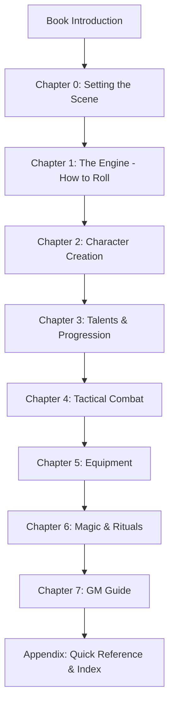

# Professionalism & Structure Proposal: Eda Core Rulebook

## Executive Summary
To elevate *Eda* from a development document to a professional bookstore-ready product, we need to focus on three pillars: **Information Architecture**, **Visual Identity**, and **Content Completeness**. The following proposal outlines the changes necessary to meet industry standards (e.g., Free League, Paizo, Wizards of the Coast).

---

## 1. Structural Overhaul (Information Architecture)

The current rulebook is "item-heavy" at the start. Players are asked to choose Heritages and Talents before they understand how a "Success" or "Reaction" works.

### Proposed Chapter Sequence
| Chapter | Title                    | Goal                                                        |
| :------ | :----------------------- | :---------------------------------------------------------- |
| **0**   | **The World of Eda**     | Setting the tone, lore, and immediate hook.                 |
| **1**   | **The Core Engine**      | How to roll, success/failure, and attributes overview.      |
| **2**   | **Creating Your Legend** | Step-by-step character creation (Nature, Heritage, Skills). |
| **3**   | **Talents & Archetypes** | Advanced customization (The Talent Pyramid).                |
| **4**   | **Tactical Survival**    | Combat, Action Economy, Reactions, and Conditions.          |
| **5**   | **Wealth & Equipment**   | Weapons, Armor, Gear, and the Silver Economy.               |
| **6**   | **Magic & The Void**     | Spellcasting, Rituals, and the cost of power (MP/Fear).     |
| **7**   | **The Game Master**      | Advice, Pacing, and Running the "Darkness."                 |
| **App** | **Appendix**             | Glossary, Index, Character Sheet, and Quick Ref.            |

---

## 2. Professional Layout Elements

To make the book look professional, we should adopt specific layout strategies beyond simple Markdown:

### A. The "Two-Column" Standard
*   **Implementation**: For the final print version, use a two-column layout. It reduces line length (easier to read) and allows for flexible image placement.
*   **Markdown Tip**: Use horizontal rules (`---`) to separate major logical sections.

### B. Recurring Sidebar Types
We should define three distinct sidebar styles:
1.  **Lore Fragment**: Italicized snippets of in-world diaries or legends.
2.  **The GM's Secret**: Advice for the Game Master on how to interpret a specific rule.
3.  **Design Note**: Explaining *why* a rule exists (builds trust with veteran players).

### C. Visual Identity & Art
*   **Art Style**: High-contrast, gritty, strictly **black-and-white**. This reinforces the dark, cold theme of Eda and allows for a stark, professional aesthetic.
*   **Chapter Headers**: Large, thematic black-and-white illustrations at the start of each chapter.
*   **Icons**: Develop small, clean icons for Attributes (e.g., a shield for CON, a sword for STR) to make tables easier to scan.

---

## 3. Missing Industry-Standard Components

A bookstore-ready RPG usually includes the following sections currently missing or underdeveloped in *Eda*:

### A. Safety Tools (Mandatory for Dark Fantasy)
*   **What**: Sections on "Lines and Veils" or the "X-Card." 
*   **Why**: Dark fantasy often touches on heavy themes (rot, mutation, fear). Professional books provide a framework for group comfort.

### B. Examples of Play
*   **What**: A 2-page scripted dialogue between a GM and three players.
*   **Why**: It is the fastest way for a new player to "get" the flow of your unique Initiative/Wait system.

### C. World Gazetteer
*   **What**: 10-15 pages detailing the Fjordlands, the major clans, and the "Black Ichor" corruption.
*   **Why**: Players buy books for the mechanics, but they *stay* for the world.

### D. GM Guidance (The "How to GM" Chapter)
*   **What**: Advice on balancing encounters, managing the "Fear" mechanic, and failing forward.
*   **Why**: A good rulebook teaches you how to *play*, but a great one teaches you how to *run* the game.

### E. Index & Glossary
*   **What**: An alphabetical list of terms and page numbers.
*   **Why**: Critical for usability during play. "Where were the Bleeding rules again?" should be answered in 5 seconds.

### F. Legal & Credits
*   **What**: A formal credits page (Design, Art, Playtesting) and a license (e.g., OGL, Creative Commons, or Proprietary).
*   **Why**: Required for professional distribution and protecting your IP.

---

## 4. Mermaid Structure Diagram

