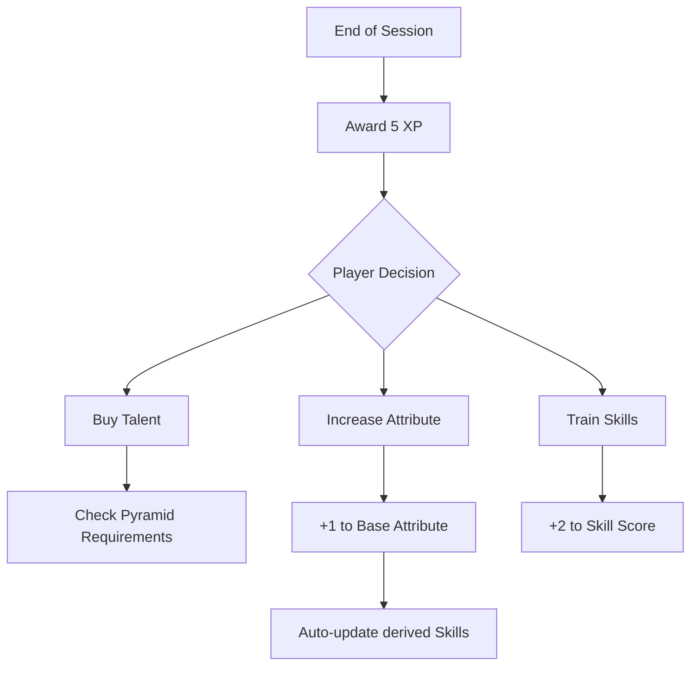

# Plan: Progression Rebalance (XP Economy)

The current XP reward of **3 XP per session** creates a "saving" mentality where players often go multiple sessions without any character growth. This feels slow and unrewarding. This plan proposes a shift to a **5 XP** baseline with clearer, more rewarding costs.

## 1. XP Income Adjustment
*   **Base Session Reward**: Increase from 3 XP to **5 XP**.
*   **Bonus XP (Optional)**: 
    *   **+1 XP** for Exceptional Roleplay (Group vote or GM choice).
    *   **+1 XP** for achieving a Minor Goal (e.g., clearing a cave).
    *   **+2 to +5 XP** for achieving a Major Goal (e.g., finishing a book/module).

## 2. Updated Cost Table
| Improvement                    | Cost  | Frequency (at 5 XP/sess) |
| :----------------------------- | :---- | :----------------------- |
| **Tier 1 Talent**              | 5 XP  | Every Session            |
| **Tier 2 Talent**              | 10 XP | Every 2 Sessions         |
| **Tier 3 Talent**              | 15 XP | Every 3 Sessions         |
| **Tier 4 Talent**              | 20 XP | Every 4 Sessions         |
| **+1 Attribute Point**         | 10 XP | Every 2 Sessions         |
| **Unlock Untrained Skill**     | 5 XP  | Every Session            |
| **Steady Training (+2 Skill)** | 1 XP  | 10 points per Session    |

## 3. Reconciliation with Campaign Books
The Campaign Books currently reference "2000 XP" or "5000 XP" milestones. These are incompatible with the low-digit XP economy and must be updated to **Session Milestones**.
*   Book 1 (Sessions 1-15): ~75-100 XP Total.
*   Book 2 (Sessions 16-35): ~200-250 XP Total.

## 4. Mermaid Flow: Progression Cycle

## 5. Implementation Steps
1.  **Core Rulebook**: Update the "Progression" section (approx. line 690) to 5 XP.
2.  **Core Rulebook**: Define "Steady Training" as 1 XP for 2 Skill points.
3.  **Campaign Books**: Replace "Level Range: XXXX XP" with "Total XP Target: XXX".
4.  **Audit**: Ensure Sample Characters (Bjorn) would be viable at these rates.
