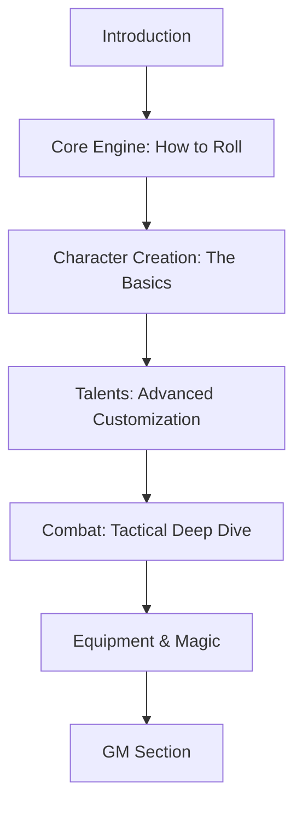

# Rulebook Restructuring Plan

## Analysis of Current Issues
The current [`Core Rulebook.md`](../Core%20Rulebook.md) is "front-heavy" because it presents specific character options (Talents, Equipment) before explaining the core mechanics (Checks, Degrees of Success, Action Economy). 

**Current Flow:**
1. Introduction -> 2. Character Creation -> 3. Skills -> 4. Talents (Huge) -> 5. Equipment -> 6. Core Rules -> 7. Combat -> 8. Magic.

## Proposed Structure: "The Engine First"
This structure moves the core resolution mechanics to the front to provide context for character choices, while maintaining a guided flow.

### 1. Introduction & The World
*   Setting the tone (Dark Fantasy).
*   High-level overview of the world.
*   The "Social Contract" (What is an RPG, Session 0).

### 2. Playing the Game (The Engine)
*   **The Dice:** Explaining the d100 (Primary/Secondary).
*   **The Core Loop:** Attribute/Skill Checks (Roll Under).
*   **Success & Failure:** Criticals, Degrees of Success.
*   **Advantage & Disadvantage:** The core modifier mechanic.
*   **Attributes & Skills Overview:** Brief description of what STR, AGI, etc., represent so players can make informed choices later.

### 3. Creating Your Character (The Driver)
*   **Step-by-Step Guide:** 
    1.  Nature (Stat Arrays).
    2.  Heritage (Origins & Traits).
    3.  Derived Stats (HP, MP, Reactions).
    4.  Skills (Training & Specialization).
*   *Note: Players now understand that picking a Heritage with "Advantage on Stealth" actually means something mechanical.*

### 4. Talents & Archetypes (The Library)
*   **The Talent Pyramid:** How to spend XP.
*   **Common Talents.**
*   **Archetype-Specific Talents.**
*   *Note: This is moved after Character Creation but before deep Combat to serve as the "Advanced Character Customization" section.*

### 5. Combat & Tactical Survival
*   **Initiative:** The Vanguard/Rearguard system and the "Wait" mechanic.
*   **Action Economy:** Action Points (AP) and Zero-Cost Actions.
*   **Movement & Cover:** Deep dive into tactical positioning.
*   **Active Defense:** Using Reactions for Dodge, Parry, and Block.
*   **Damage & Wounds:** HP, Death, and Recovery.

### 6. Equipment & Economy
*   Currency & Trade.
*   Weapons, Armor, and Shields.
*   Adventuring Gear & Relics.

### 7. Magic & Rituals
*   The cost of Magic (Mind Points).
*   Spells & Rituals.

### 8. Game Master Section
*   Bestiary & Running Adventures.

---

## Benefits
1.  **Contextual Choices:** Players know how the game works before they have to choose between "Vanguard" talents or "Shield DR" bonuses.
2.  **Reduced Friction:** By moving the ~250 lines of Talents further back, readers get to the "how to play" part much faster.
3.  **Logical Grouping:** Core Mechanics are separated from Tactical Combat, allowing for a "Quick Start" feel.

## Mermaid Diagram of the Flow

