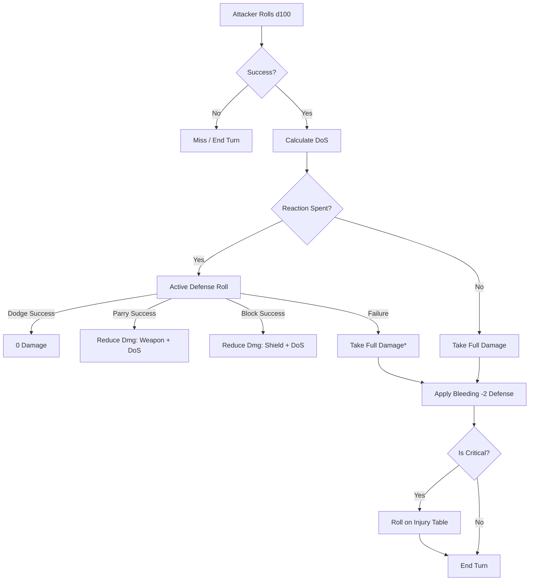

# Eda Consistency & Improvement Plan

This plan outlines the steps required to standardize the mechanics, nomenclature, and tone of the Eda TTRPG system.

## 1. Core Mechanics Standardization

### 1.1 Bleeding Condition
*   **Current Issue**: Inconsistency between -2 Defense (Rules) and +1 Damage/Stack (Example/Cheat Sheet).
*   **Resolution**: Standardize to **-2 Defense penalty**. It does not stack, but is easy to inflict. This makes armor feel valuable and its loss significant.
*   **Files to Update**: [`Core Rulebook.md`](../Core%20Rulebook.md), [`Cheat_Sheet.md`](../Cheat_Sheet.md), [`Creature_Compendium.md`](../Creature_Compendium.md).

### 1.2 Reaction Pool
*   **Current Issue**: Confusion between "per round" and "per encounter" recovery.
*   **Resolution**: Confirm it is a **finite pool for the entire encounter**.
*   **Talent Rebalance**:
    *   `Vanguard Reflexes` (Veteran T3): Change from "recover all every round" to "regain 1 reaction at the start of each round."
*   **Files to Update**: [`Core Rulebook.md`](../Core%20Rulebook.md).

### 1.3 Combat Magic Scaling
*   **Current Issue**: Fixed damage values (7, 10) make magic feel static.
*   **Resolution**: Change combat spell damage to **Base + DoS**.
    *   *Blight*: 5 Base + DoS.
    *   *Vomit Fire*: 8 Base + DoS.
*   **Files to Update**: [`Core Rulebook.md`](../Core%20Rulebook.md).

## 2. Nomenclature & Terminology

### 2.1 Harmonize Attributes and Skills
*   **Current Issue**: "Willpower", "Fitness", and "Half Actions" are legacy terms from development.
*   **Resolution**:
    *   Replace **Willpower** with **Instinct (INS)**.
    *   Replace **Fitness** with **Constitution (CON)** or **Athletics**.
    *   Replace **Fatigue** with **Exhaustion**.
    *   Replace **Half Action** with **1 AP**.
*   **Files to Update**: [`World_of_Eda.md`](../World_of_Eda.md), [`Cheat_Sheet.md`](../Cheat_Sheet.md), [`Core Rulebook.md`](../Core%20Rulebook.md).

## 3. Tonal & Setting Consistency

### 3.1 Remove Modernisms
*   **Current Issue**: References to London, Pianos, and Extraterrestrials in a dark fantasy setting.
*   **Resolution**:
    *   *Piano* -> *Harpsichord* or *Lute*.
    *   *London* -> *Lundenwic* or a generic high-fantasy capital.
    *   *Extraterrestrial* -> *Void-born* or *Outer Entities*.
*   **Files to Update**: [`Core Rulebook.md`](../Core%20Rulebook.md), [`World_of_Eda.md`](../World_of_Eda.md).

## 4. Bug Fixes & Typos
*   **Creature Compendium**: Fix "happiness entropy" typo and ensure all creature stats follow the new standardized rules.
*   **Injury Table**: Align the `Vulnerable` and `Stunned` descriptions between the Core Rulebook and Cheat Sheet.

## Mermaid Workflow: Combat Resolution (Corrected)

*Note: Block failure still results in Half Damage.*
