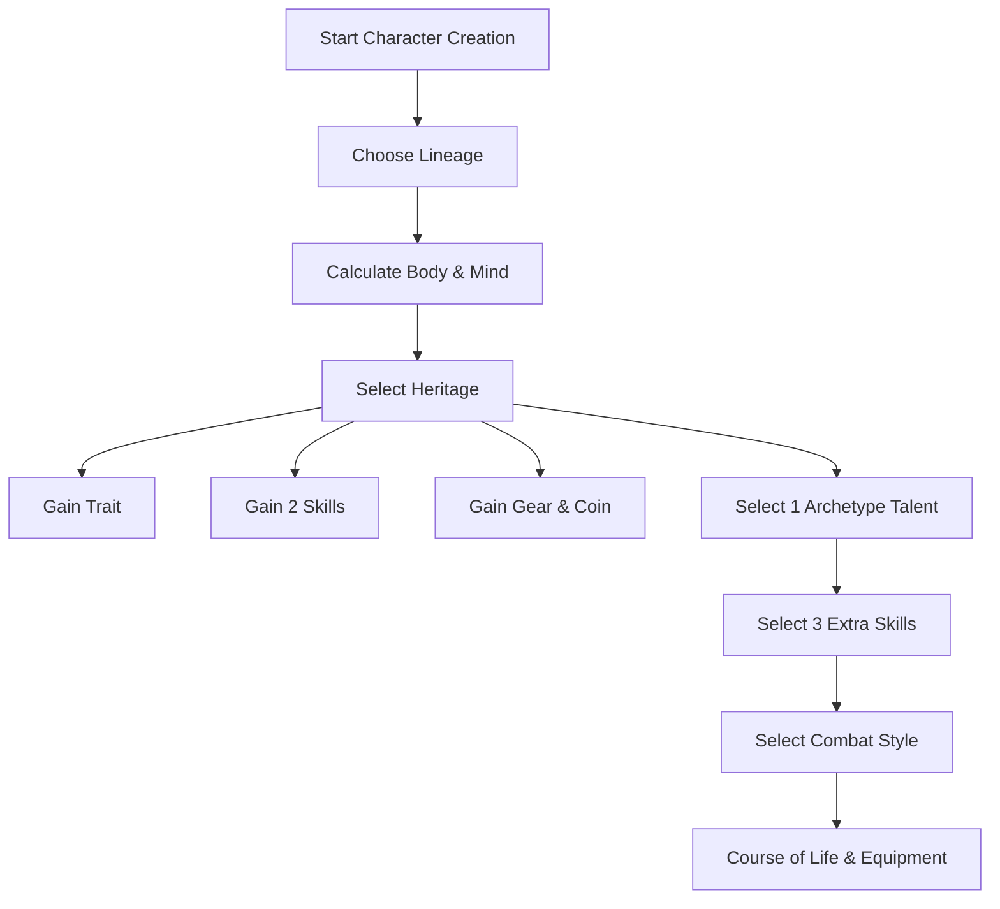

# Heritage and Archetype Merge Plan

## Objective
Merge the "Heritage" (Background) and "Archetype" (Talent Tree) concepts into a single choice at character creation. This streamlines character creation and ensures that a character's background directly informs their initial capabilities.

## Proposed Changes

### 1. Unified Heritage List
The current 7 Heritages and 9 Archetypes will be merged into 11 distinct Heritages. Each Heritage will provide a Background flavor, a Signature Trait, two Heritage Skills, Starting Equipment, Starting Currency, and a choice of one Tier 1 Talent from its associated Archetype tree.

| Heritage Name | Associated Archetype | Skills |
| :--- | :--- | :--- |
| **Zealot** | Zealot | Religion, Medicine |
| **Noble** | Noble (was Earl) | Diplomacy, History |
| **Outcast** | Outcast (was Thug) | Streetwise (Urban Stealth/Crime), Intimidate |
| **Veteran** | Veteran | Survival, Athletics |
| **Huntsman** | Huntsman | Survival, Nature |
| **Warden** | Warden | Nature, Athletics |
| **Wanderer** | Wanderer | Occult Knowledge, Investigation |
| **Witch** | Witch | Occult Knowledge, Alchemy |
| **Troubadour** | Troubadour | Entertain, Diplomacy |
| **Artisan** | Artisan (New) | Crafting, Engineering |
| **Merchant** | Merchant (New) | Barter, Appraise |
| **Clansman** | Clansman (New) | Survival, Intimidate |
| **Farmer** | Farmer (New) | Nature, Athletics |

### 2. Character Creation Workflow
1.  **Lineage**: Choose attributes.
2.  **Body & Mind**: Calculate HP, IP, and Reactions.
3.  **Heritage**: Select one Heritage.
    - Gain the **Signature Trait**.
    - Gain two **Heritage Skills** (Trained).
    - Gain **Starting Equipment** and **Currency**.
    - **Choose one Tier 1 Talent** from the associated Archetype list.
4.  **Skills**: Select 3 *additional* Trained Skills (as before).
5.  **Combat Styles**: Select 1 Combat Style.
6.  **Course of Life**: Finalize background/goals.

### 3. New Talent Trees (Tier 1)

#### Artisan
- **Master Crafter**: Advantage on all Crafting checks.
- **Structural Weakness**: Identify flaws in objects; advantage on damage checks against structures or armor.
- **Field Repairs**: Can repair one piece of damaged equipment during a short rest.
- **Gadgeteer**: Once per day, create a temporary tool or gadget that provides advantage on one specific non-combat task.
- **Heavy Hitter**: When using a hammer, axe, or pick, you may use Logic instead of Strength for the attack roll.

#### Merchant
- **Master of Barter**: Advantage on all Barter checks.
- **Spot the Lie**: Advantage on Insight to detect deception during negotiations.
- **Hidden Pocket**: You have a concealed space on your person that can hold up to three small items, undetectable by normal searches.
- **Network of Contacts**: Once per session, you can find a contact in a settlement who provides basic info or a 20% discount on one service.
- **Distracting Coin**: (1 AP) Toss a coin or trinket. One target within 5m has disadvantage on their next roll this round.

#### Clansman
- **Tribal Ferocity**: Advantage on melee attacks when you have taken damage this encounter.
- **Mountain Born**: Ignore difficult terrain in cold or rocky environments.
- **Blood Debt**: Once per day, if an ally is downed, you gain advantage on all attacks until the end of the encounter.
- **North-Burn Breath**: You can drink "North-Burn" spirits as a free action to gain 5 Temp HP.
- **Skald's Song**: (1 AP) Shout a battle cry; allies within 5m gain +1 to their next damage roll.

#### Farmer
- **Scythe Sweep**: When using a polearm or scythe, you can hit two adjacent targets with one attack roll (damage is halved).
- **Animal Husbandry**: You have a loyal farm dog or goat that can assist in tracking or guarding.
- **Weather Wise**: You can predict the weather for the next 24 hours with 100% accuracy.
- **Seasoned Toil**: You gain +5 to Constitution checks.
- **Improvised Defense**: You can use a pitchfork or shovel as a shield (providing +5 defense).

### 4. Updates to Core Rulebook.md
- **Character Creation Section**: Update Step 3 and Step 5 to reflect the merger.
- **Heritage Section**: Complete rewrite to use the new names and include the Talent choice.
- **Talents Section**: Add the new Artisan, Merchant, Clansman, and Farmer T1 talents.
- **Renaming**: Rename "Earl Talents" to "Noble Talents" and "Thug Talents" to "Outcast Talents" throughout the document.
- **New Archetypes**: Formally define Clansman, Farmer, Artisan, and Merchant as Archetypes for future progression (even if they only have T1 for now).
- **Witch/Troubadour Details**: Define full Heritage profiles for these two.

## Mermaid Diagram of New Flow

