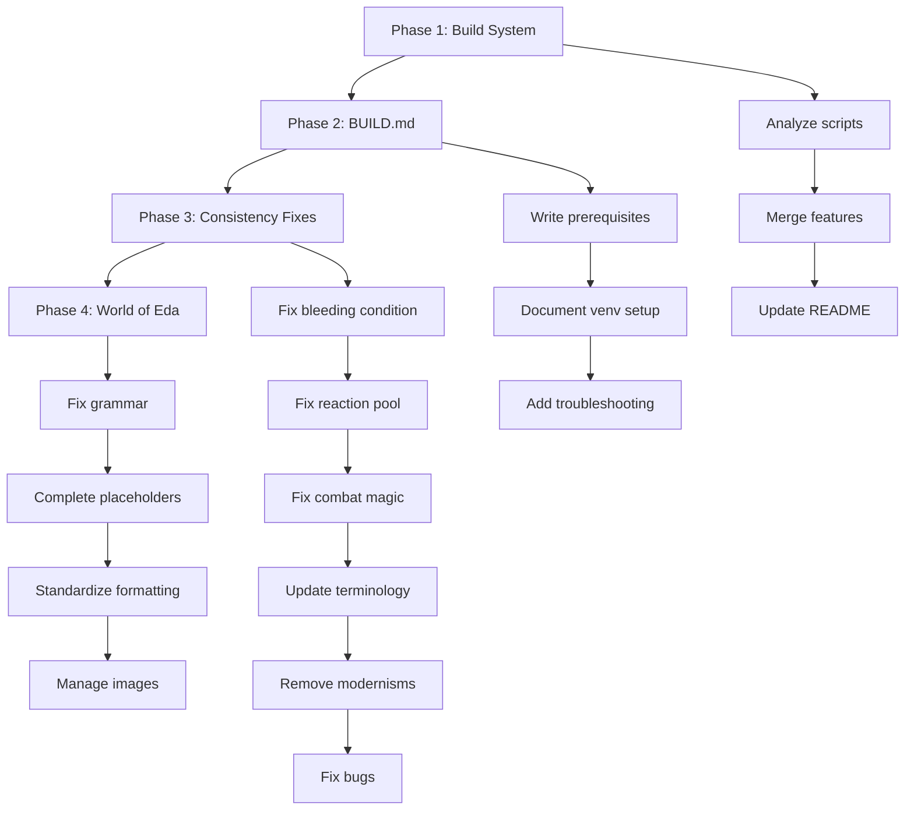

# Implementation Plan - High Priority Items

## Overview
This plan outlines the implementation of the four high-priority recommendations from the project analysis.

---

## Phase 1: Build System Consolidation

### 1.1 Consolidate Build Scripts

**Objective:** Merge three build scripts into a single, robust build script using WeasyPrint.

**Files to Modify:**
- [`scripts/build.py`](../scripts/build.py) - Enhance and make primary
- [`scripts/generate_pdfs.py`](../scripts/generate_pdfs.py) - Deprecate
- [`scripts/generate_pdfs_weasy.py`](../scripts/generate_pdfs_weasy.py) - Deprecate
- [`README.md`](../README.md) - Update build instructions

**Steps:**
1. Analyze all three scripts to understand their features
2. Merge features into `build.py`:
   - Keep WeasyPrint as PDF generator (no Node.js dependency)
   - Add proper error handling and progress indicators
   - Include character sheet generation workflow
   - Add cleanup of intermediate files
3. Create backup of old scripts
4. Delete deprecated scripts
5. Update README.md with correct build command

**Success Criteria:**
- Single `python scripts/build.py` command builds all PDFs
- Build completes in < 2 minutes
- All PDFs generate correctly
- No manual steps required

---

## Phase 2: Create BUILD.md Documentation

**Objective:** Create comprehensive build documentation.

**New File:**
- `BUILD.md` - Complete build guide

**Content Sections:**
1. Prerequisites
   - Python 3.10+
   - Pandoc installation instructions for macOS/Linux/Windows
   - WeasyPrint installation with system dependencies
2. Virtual Environment Setup
   - Creating venv
   - Activating venv
   - Installing dependencies
3. Building PDFs
   - Command to build all PDFs
   - Command to build specific PDF
   - Troubleshooting common issues
4. Character Sheet Generation
   - Special notes about character sheet
   - Coordinate system explanation
5. Development Workflow
   - How to test changes
   - How to regenerate PDFs

**Success Criteria:**
- New users can build PDFs without asking questions
- All common issues have solutions documented
- Instructions work on macOS, Linux, and Windows

---

## Phase 3: Implement Consistency Fixes

**Objective:** Fix rule inconsistencies identified in [`consistency_audit_plan.md`](consistency_audit_plan.md).

**Files to Modify:**
- [`Core Rulebook.md`](../Core%20Rulebook.md)
- [`Cheat_Sheet.md`](../Cheat_Sheet.md)
- [`Creature_Compendium.md`](../Creature_Compendium.md)
- [`World_of_Eda.md`](../World_of_Eda.md)

**Specific Fixes:**

### 3.1 Bleeding Condition
- **Standardize:** -2 Defense penalty (non-stacking)
- **Update:** Core Rulebook, Cheat Sheet, Creature Compendium
- **Remove:** Any references to +1 Damage/Stack

### 3.2 Reaction Pool
- **Clarify:** Finite pool for entire encounter (not per round)
- **Update Talent:** `Vanguard Reflexes` (Veteran T3) - Change from "recover all every round" to "regain 1 reaction at start of each round"
- **Files:** Core Rulebook

### 3.3 Combat Magic Scaling
- **Change:** Combat spell damage to Base + DoS
  - *Blight*: 5 Base + DoS
  - *Vomit Fire*: 8 Base + DoS
- **Files:** Core Rulebook

### 3.4 Terminology Updates
- Replace **Willpower** with **Instinct (INS)**
- Replace **Fitness** with **Constitution (CON)** or **Athletics**
- Replace **Fatigue** with **Exhaustion**
- Replace **Half Action** with **1 AP**
- **Files:** World_of_Eda.md, Cheat_Sheet.md, Core Rulebook.md

### 3.5 Remove Modernisms
- *Piano* → *Harpsichord* or *Lute*
- *London* → *Lundenwic* or generic fantasy capital
- *Extraterrestrial* → *Void-born* or *Outer Entities*
- **Files:** Core Rulebook.md, World_of_Eda.md

### 3.6 Bug Fixes
- Fix "happiness entropy" typo in Creature Compendium
- Align `Vulnerable` and `Stunned` descriptions between Core Rulebook and Cheat Sheet
- Ensure all creature stats follow standardized rules

**Success Criteria:**
- All terms consistent across all documents
- No contradictions in rules
- Grammar and spelling errors fixed

---

## Phase 4: Complete World of Eda Content

**Objective:** Fill in placeholder content and fix quality issues.

**File to Modify:**
- [`World_of_Eda.md`](../World_of_Eda.md)

**Steps:**

### 4.1 Grammar and Spelling Fixes
- Run spell check on entire document
- Fix grammar errors (e.g., "roughly" → "roughly", "extenstion" → "extinction")
- Improve sentence structure and clarity

### 4.2 Complete Placeholder Sections
- Identify all sections with placeholder text
- Write complete content for each section
- Ensure consistent tone and style

### 4.3 Standardize Formatting
- Ensure consistent heading levels
- Standardize image placement
- Check table formatting
- Verify all links work

### 4.4 Image Management
- Replace `images/placeholder.png` with actual images where available
- Update art placement plan to reflect current state
- Document missing images

**Success Criteria:**
- No placeholder text remaining
- Zero grammar/spelling errors
- Consistent formatting throughout
- All images properly referenced

---

## Implementation Order

---

## Risk Mitigation

| Risk | Mitigation |
|------|------------|
| Breaking existing build | Keep backups of old scripts until new one is verified |
| Introducing new inconsistencies | Review all changes against existing content |
| Spending too much time on World of Eda | Focus on critical fixes first, defer creative content |
| Missing system dependencies | Document all dependencies clearly in BUILD.md |

---

## Testing Plan

After each phase:
1. Build all PDFs to ensure nothing is broken
2. Review changes for consistency
3. Run spell/grammar check
4. Verify all links and references work

---

## Timeline Estimate

- Phase 1 (Build System): 2-3 hours
- Phase 2 (BUILD.md): 1 hour
- Phase 3 (Consistency): 2-3 hours
- Phase 4 (World of Eda): 3-4 hours

**Total: 8-11 hours**

---

## Next Steps

1. Switch to Code mode
2. Begin Phase 1: Build System Consolidation
3. Proceed through phases sequentially
4. Test after each phase
5. Update this plan as needed
