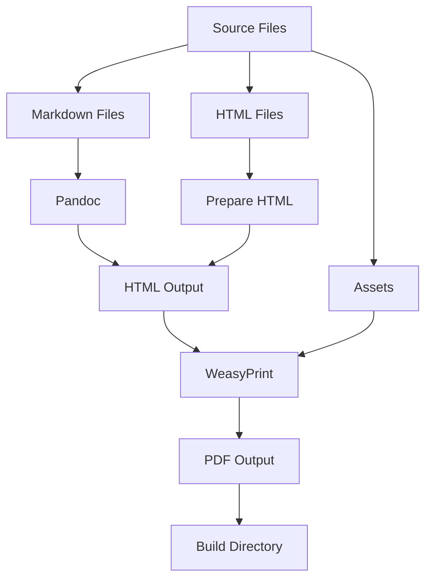
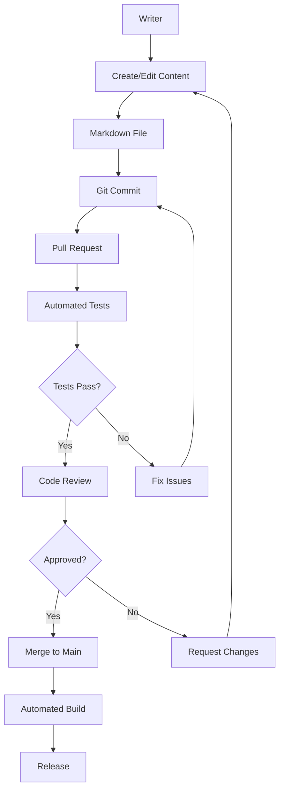

# Eda TTRPG Project - Comprehensive Recommendations

## Executive Summary

This document provides a comprehensive analysis of the Eda TTRPG project and recommendations for improvements across build systems, content organization, technical debt, and project management.

---

## 1. Build System Issues & Recommendations

### 1.1 Critical Issue: Duplicate Build Scripts

**Problem:** The project has three different build scripts with overlapping functionality:
- [`scripts/generate_pdfs.py`](../scripts/generate_pdfs.py) - Uses Pandoc + md-to-pdf (Node.js)
- [`scripts/generate_pdfs_weasy.py`](../scripts/generate_pdfs_weasy.py) - Uses Pandoc + WeasyPrint
- [`scripts/build.py`](../scripts/build.py) - Uses Pandoc + WeasyPrint with additional logic

**Impact:**
- Confusion about which script to use
- Maintenance burden (three codebases to update)
- Inconsistent PDF output
- README.md references `generate_pdfs.py` but other scripts may be more appropriate

**Recommendation:**
1. **Consolidate to a single build script** - Choose WeasyPrint as the primary PDF generator (Python-native, no Node.js dependency)
2. **Deprecate and remove** `generate_pdfs.py` and `generate_pdfs_weasy.py`
3. **Enhance** `build.py` with all necessary features:
   - Proper error handling
   - Progress indicators
   - Build caching
   - Parallel processing for multiple files
4. **Update README.md** to reference the correct build command

### 1.2 Character Sheet Generation Complexity

**Problem:** The character sheet generation process is overly complex:
- Requires multiple steps: HTML → prepare_html.py → generate_interactive_sheet.py
- Manual field positioning via `coordinates.json`
- Multiple intermediate files
- No automated testing of the generated PDF

**Recommendation:**
1. **Simplify the workflow** - Create a single script that handles the entire process
2. **Automate field positioning** - Use CSS-based positioning instead of manual coordinates
3. **Add validation** - Verify all form fields are present and correctly positioned
4. **Create test suite** - Automated tests to verify PDF generation works correctly

### 1.3 Missing Build Dependencies Documentation

**Problem:** The project lacks clear documentation about:
- System requirements (Python version, Pandoc version, etc.)
- How to set up the virtual environment
- How to install WeasyPrint with proper system dependencies
- Troubleshooting common build issues

**Recommendation:**
1. **Create** `BUILD.md` with detailed build instructions
2. **Add** a `Makefile` or `package.json` for common commands
3. **Include** a troubleshooting section for common issues
4. **Document** the virtual environment setup process

---

## 2. Content Organization Issues & Recommendations

### 2.1 Conflicting Plans for Heritage/Archetype Systems

**Problem:** Multiple conflicting plans exist:
- [`plans/heritage_archetype_merge.md`](heritage_archetype_merge.md) - Merge heritage and archetypes
- [`plans/tag_system_redesign.md`](tag_system_redesign.md) - Tag-based system
- [`plans/talent_reorganization.md`](talent_reorganization.md) - Reorganize talents

**Impact:**
- Unclear which direction to take
- Potential for incomplete implementation
- Wasted effort on conflicting approaches

**Recommendation:**
1. **Convene a decision** - Choose ONE approach and document it
2. **Archive** the other plans with clear reasoning
3. **Create** a single, comprehensive implementation plan
4. **Prioritize** based on impact and effort

### 2.2 Inconsistent Rules Across Documents

**Problem:** As identified in [`plans/consistency_audit_plan.md`](consistency_audit_plan.md):
- Bleeding condition inconsistency
- Reaction pool confusion
- Combat magic scaling issues
- Legacy terminology (Willpower, Fitness, Half Actions)
- Modernisms in fantasy setting

**Recommendation:**
1. **Implement** the consistency audit plan
2. **Create** a "Rules Glossary" document defining all terms
3. **Establish** a style guide for writing rules
4. **Implement** automated checks for common inconsistencies

### 2.3 Incomplete World of Eda Content

**Problem:** [`World_of_Eda.md`](../World_of_Eda.md) has:
- Incomplete sections (placeholder text)
- Grammar and spelling errors
- Inconsistent formatting
- Missing images (using placeholders)

**Recommendation:**
1. **Complete** all placeholder sections
2. **Run** a grammar/spell check on all documents
3. **Standardize** formatting across all markdown files
4. **Create** a content checklist for each document

### 2.4 Talent System Disorganization

**Problem:** Talents are currently in a massive master table that's hard to navigate.

**Recommendation:**
1. **Implement** the talent reorganization plan
2. **Group** talents by heritage/archetype
3. **Create** a master index for quick reference
4. **Add** visual indicators for talent tiers

---

## 3. Technical Debt & Recommendations

### 3.1 No Automated Testing

**Problem:** The project lacks:
- Unit tests for game mechanics
- Integration tests for build process
- Balance testing via combat_sim.py

**Recommendation:**
1. **Create** test suite using pytest
2. **Add** tests for core game mechanics (DoS calculation, damage, etc.)
3. **Implement** build process tests
4. **Integrate** combat_sim.py into CI/CD pipeline

### 3.2 No Version Control Strategy

**Problem:** No clear strategy for:
- Semantic versioning
- Release management
- Changelog maintenance

**Recommendation:**
1. **Adopt** semantic versioning (v1.0.0, v1.1.0, etc.)
2. **Create** `CHANGELOG.md` following Keep a Changelog format
3. **Use** git tags for releases
4. **Document** release process

### 3.3 No CI/CD Pipeline

**Problem:** No automated:
- Build verification
- Testing on pull requests
- Release generation

**Recommendation:**
1. **Set up** GitHub Actions or similar CI/CD
2. **Configure** automated builds on push
3. **Add** automated testing
4. **Implement** automated release generation

### 3.4 Code Quality Issues

**Problem:**
- No code style guide
- No linting configuration
- Inconsistent code formatting

**Recommendation:**
1. **Create** Python code style guide (PEP 8)
2. **Add** `pylint` or `flake8` configuration
3. **Implement** `black` for code formatting
4. **Add** pre-commit hooks

---

## 4. Project Management Recommendations

### 4.1 Missing Documentation

**Problem:** Lack of:
- Contributor guidelines
- Architecture documentation
- Roadmap
- Known issues

**Recommendation:**
1. **Create** `CONTRIBUTING.md` with contribution guidelines
2. **Add** `ARCHITECTURE.md` explaining project structure
3. **Create** `ROADMAP.md` with planned features
4. **Maintain** `KNOWN_ISSUES.md`

### 4.2 No Issue Tracking

**Problem:** No system for tracking:
- Bugs
- Feature requests
- Documentation issues

**Recommendation:**
1. **Set up** GitHub Issues with templates
2. **Create** issue templates for bug reports, features, docs
3. **Implement** labels for categorization
4. **Define** triage process

### 4.3 No Project Timeline

**Problem:** No clear timeline for:
- Implementing existing plans
- Completing incomplete sections
- Releasing versions

**Recommendation:**
1. **Create** project timeline with milestones
2. **Prioritize** tasks by impact and effort
3. **Set** realistic deadlines
4. **Track** progress regularly

---

## 5. Specific Action Items (Prioritized)

### High Priority (Do First)

1. **Consolidate build scripts** - Remove duplicate build scripts, enhance `build.py`
2. **Fix consistency issues** - Implement the consistency audit plan
3. **Complete World of Eda** - Fill in placeholder content, fix grammar
4. **Create BUILD.md** - Document build process clearly

### Medium Priority (Do Soon)

5. **Implement talent reorganization** - Make talents easier to find
6. **Add automated testing** - Create test suite for game mechanics
7. **Set up CI/CD** - Automated builds and testing
8. **Create contributor guidelines** - Make it easy for others to help

### Low Priority (Do Later)

9. **Simplify character sheet generation** - Reduce complexity
10. **Implement version control strategy** - Semantic versioning, changelog
11. **Add code quality tools** - Linting, formatting
12. **Create project roadmap** - Long-term planning

---

## 6. Architecture Recommendations

### 6.1 Directory Structure Improvements

**Current Structure:**
```
eda/
├── scripts/
├── images/
├── plans/
├── build/
└── *.md files
```

**Recommended Structure:**
```
eda/
├── docs/
│   ├── core/
│   │   ├── Core Rulebook.md
│   │   ├── Cheat Sheet.md
│   │   └── Character Sheet.md
│   ├── gm/
│   │   └── World of Eda.md
│   ├── adventures/
│   │   └── Adventure_The_Age_of_Wolves.md
│   └── compendiums/
│       └── Creature_Compendium.md
├── scripts/
│   ├── build/
│   │   ├── build.py
│   │   └── utils.py
│   ├── tools/
│   │   ├── combat_sim.py
│   │   └── generate_interactive_sheet.py
│   └── tests/
├── assets/
│   ├── images/
│   └── styles/
├── plans/
│   ├── active/
│   ├── completed/
│   └── archived/
├── build/
├── tests/
├── venv/
├── .github/
│   └── workflows/
├── README.md
├── CONTRIBUTING.md
├── BUILD.md
├── CHANGELOG.md
├── ARCHITECTURE.md
└── ROADMAP.md
```

### 6.2 Build Process Flow



### 6.3 Content Creation Workflow



---

## 7. Risk Assessment

### 7.1 High Risk Issues

1. **Build script confusion** - Could lead to broken builds
2. **Inconsistent rules** - Could confuse players and GMs
3. **No automated testing** - Bugs could go unnoticed

### 7.2 Medium Risk Issues

4. **Incomplete documentation** - Could deter contributors
5. **No CI/CD** - Manual process is error-prone
6. **Conflicting plans** - Could waste development effort

### 7.3 Low Risk Issues

7. **Code quality** - Doesn't affect end users
8. **Project structure** - Can be refactored gradually
9. **Character sheet complexity** - Works, just could be better

---

## 8. Success Metrics

To measure the success of these recommendations:

1. **Build System**
   - Single build script that works reliably
   - Build time < 2 minutes
   - Zero manual steps required

2. **Content Quality**
   - Zero grammar/spelling errors
   - All placeholder content completed
   - Consistent formatting across all documents

3. **Technical Quality**
   - 80%+ test coverage
   - All CI/CD tests passing
   - Zero critical bugs

4. **Project Health**
   - Active contributors
   - Regular releases
   - Clear roadmap progress

---

## 9. Next Steps

1. **Review this document** with the team
2. **Prioritize recommendations** based on team capacity
3. **Create implementation plan** for high-priority items
4. **Assign owners** to each task
5. **Set up tracking** for progress
6. **Begin implementation**

---

## 10. Conclusion

The Eda TTRPG project has a solid foundation with excellent content and creative vision. However, it suffers from technical debt, inconsistent processes, and incomplete documentation. By addressing these issues systematically, the project can become more maintainable, attract more contributors, and provide a better experience for players and GMs.

The key is to start with high-priority items that have the biggest impact, then gradually work through the medium and low-priority items as time and resources allow.
