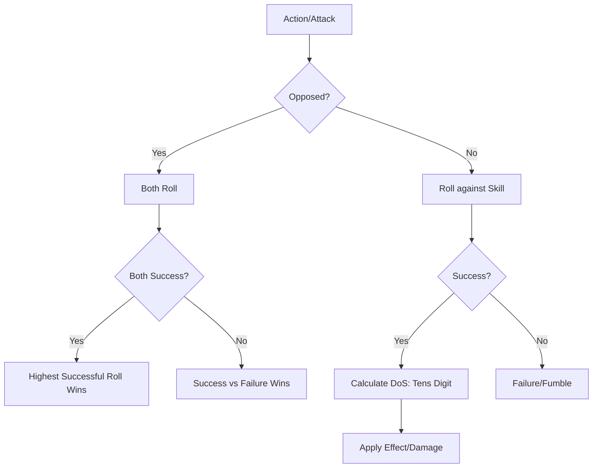

# Rulebook Analysis & Refinement Plan: Project Eda

This document outlines the findings of a comprehensive review of the `Core Rulebook.md`, `Bestiary.md`, and `Adventure_The_Age_of_Wolves.md`. It identifies inconsistencies, undefined mechanics, and areas where the core resolution system (Checks, DoS, Advantage/Disadvantage, Opposing Rolls) is not properly applied.

## 1. Core Mechanical Inconsistencies

### Defense Mechanics (High Risk vs. Reliable Mitigation)
*   **Dodge** ([`Core Rulebook.md:673`](Core%20Rulebook.md:673)): Requires a **Challenge (2 DoS)** check. Reward: No damage.
*   **Parry/Block** ([`Core Rulebook.md:676`](Core%20Rulebook.md:676)): Only requires a "Success." Reward: Damage reduction.
*   **Status**: Confirmed as intended. Parry/Block are designed to be easier to achieve (0 DoS/Success) than Dodge (2 DoS) because they only provide partial mitigation rather than total negation.

### Opposed Checks vs. Independent Checks
*   **Spells** ([`Core Rulebook.md:914`](Core%20Rulebook.md:914)): Spells like *Freeze in Place* mention "MND vs CON check to resist" but don't specify if this follows the "Opposing Rolls" rule ([`Core Rulebook.md:81`](Core%20Rulebook.md:81)) where the highest success wins.
*   **Proposed Fix**: Explicitly state that all "Attribute vs Attribute" resistances use the **Opposing Rolls** mechanic.

### Damage Consistency
*   **Base Rules**: Damage = **Weapon Base + DoS**.
*   **Adventure Inconsistency**: `Adventure_The_Age_of_Wolves.md` uses **1d10** for many damage sources (e.g., lines 222, 361).
*   **Proposed Fix**: Update the adventure to use the core damage mechanic (e.g., "Take 5 Damage" or "Take Base 4 + DoS damage") to ensure the 2d10 system remains central.

---

## 2. Undefined or Ambiguous Mechanics

### Fear & Mind Point Consistency
*   **Automatic vs. Resisted**: Some sources of Fear cause automatic MP loss (e.g., [`Ichor-Wolf`](Bestiary.md:86)), while others imply a check is possible (e.g., [`Dvergr Trait`](Core%20Rulebook.md:172)).
*   **Frightened Recovery**: The rule says you are Frightened until you recover MP "fully" ([`Core Rulebook.md:687`](Core%20Rulebook.md:687)).
*   **Status**: Confirmed as intended. A character remains **Frightened** until they reach their **Maximum Mind Points**. This highlights the severity of mental trauma in Eda.
*   **Proposed Fix**: Ensure all Bestiary entries specify if a MND check is allowed to resist MP loss, as the consequence of hitting 0 MP is extremely severe.

### Reaction Economy & Scaling
*   **Static Pool**: Reactions do not refresh per round but are a fixed pool for the "entire encounter" ([`Core Rulebook.md:667`](Core%20Rulebook.md:667)).
*   **Enemy Inconsistency**: Bestiary entries currently have static reaction pools (e.g., 1 or 2) that do not match the player rule of "tens digit of AGI."
*   **Status**: Confirmed as intended to match players. Enemies and bosses should derive their Reaction Pool from the **Tens Digit of their AGI** attribute.
*   **Proposed Fix**: Update all Bestiary entries to calculate Reactions based on AGI. This will naturally scale the survivability of faster enemies and bosses.

### Missing Terminology
*   **Morale Check**: Referenced in the **Intimidation** talent ([`Core Rulebook.md:453`](Core%20Rulebook.md:453)) but never defined.
*   **Saves**: The adventure uses "Constitution Save," while the core rules only use "Checks."
*   **Proposed Fix**: Define a "Morale Check" (likely a MND check). Consolidate "Saves" into the "Check" terminology (e.g., "CON Check to resist").

### Condition Synonym Consolidation (The "Stuck" Issue)
*   **Redundant Terms**: The rules use **Immobilized** (defined), **Stuck** (Bestiary), **Grappled** (Adventure), and **Restrained** (Talent).
*   **Proposed Fix**: Consolidate all these terms into **Immobilized** to avoid confusion. If a "stronger" version is needed (e.g., for Grappling), define **Restrained** as a condition that includes **Immobilized** plus **Disadvantage** on attacks.

### Terminology Overlap
*   **Degree of Success (DoS)**: Used for roll results (tens digit) and as a static requirement. It's also used to describe the static reaction pool (tens digit of AGI).
*   **Proposed Fix**: Use "Attribute Tens Digit" or "Attribute Bonus" for static derived values, and reserve "Degree of Success" exclusively for roll results.

---

## 3. Actionable Refinement Steps (TODO)

### Step 1: Core Rulebook Standardization
- [ ] Define **Morale Check** as a MND check.
- [ ] Add **Stuck** and **Grappled** to the Conditions table (consolidated with Immobilized).
- [ ] Clarify that **Resistances** (e.g., MND vs CON) use the **Opposing Rolls** mechanic.

### Step 2: Bestiary Alignment
- [ ] Update all creature abilities (Webbing, Neurotoxin, etc.) to specify a **DoS requirement** (Routine, Challenge, etc.) for the resistance check.
- [ ] Recalculate all creature **Reaction Pools** to match the player rule (Tens digit of AGI).
- [ ] Standardize terminology (e.g., change "Stuck" to "Immobilized").

### Step 3: Adventure Polish
- [ ] Replace **1d10 damage** rolls with static damage or Base + DoS formulas.
- [ ] Rename **Fatigue** to **Exhaustion** to match the core rulebook.
- [ ] Correct Armor/Weapon values (e.g., Chain Mail Defense 4 -> 2) to match the equipment tables.

### Step 4: Logic Verification
- [ ] Review the **Ichor Siphon** and **Fear Aura** mechanics. Should they require a MND check or remain automatic MP loss? (Recommendation: Require a MND check to resist, with automatic loss on failure).

---

## Mermaid Diagram: Resolution Flow

