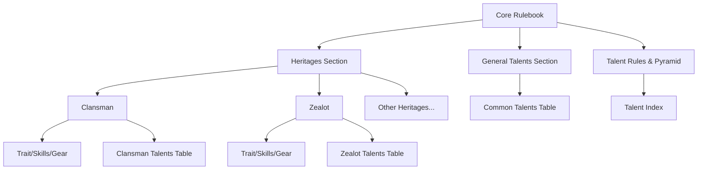

# Talent Reorganization Plan

## Objective
Reorganize the talent system in `Core Rulebook.md` to be more user-friendly. Instead of a single "Master Talent Table" at the end, talents will be grouped by their **Identity Tag** and placed directly within each **Heritage** section. This allows players to see all relevant progression options for their chosen background in one place.

## Changes

### 1. Heritage Sections
Each Heritage (Clansman, Zealot, etc.) will receive a new sub-heading: `#### [Heritage Name] Talents`.
- This section will contain a table of all talents tagged with that heritage's name.
- Talents will be listed by Tier (T1 to T4).
- Talents with multiple tags (e.g., `[Clansman], [Veteran]`) will be duplicated in both relevant heritage sections.

### 2. General Talents Section
A new section `### General Talents` will be created to house talents tagged as `[Common]`.
- These are talents available to any character regardless of heritage.
- Some `[Common]` talents that also have a specific heritage tag will appear in both the General list and the specific Heritage list.

### 3. Talent Rules & Index
The `## Talents` section will be simplified to:
- Retain the **Talent Pyramid** rules and XP costs.
- Provide a "Master Index" that links to the Heritage sections.
- Remove the massive Master Talent Tables.

## Proposed Layout Example (Clansman)

#### Clansman
... (Existing Trait, Skills, Gear) ...

**Clansman Talents**
| Tier | Talent | Cost | Description |
| :--- | :--- | :--- | :--- |
| T1 | **Berserk** | 1 AP | Enter frenzy (advantage on attacks, no reactions). |
| T1 | **Heavy Hitter** | Passive | Use Logic instead of STR for attack with tools. |
| T2 | **Bloodied Fury** | Passive | HP < 50%: all attacks deal +5 damage. |
| ... | ... | ... | ... |

## Mermaid Diagram

## Implementation Steps
1.  **Extract & Map**: Categorize all ~100 talents by their tags.
2.  **Update Heritages**: Insert the relevant talent tables into each of the 10 heritage sections.
3.  **Create General Section**: Move `[Common]` talents to a new section.
4.  **Cleanup**: Remove the old Master Tables and update the `## Talents` section with the new index.
5.  **Audit**: Ensure no talents were lost and all cross-tagged talents are in both places.
