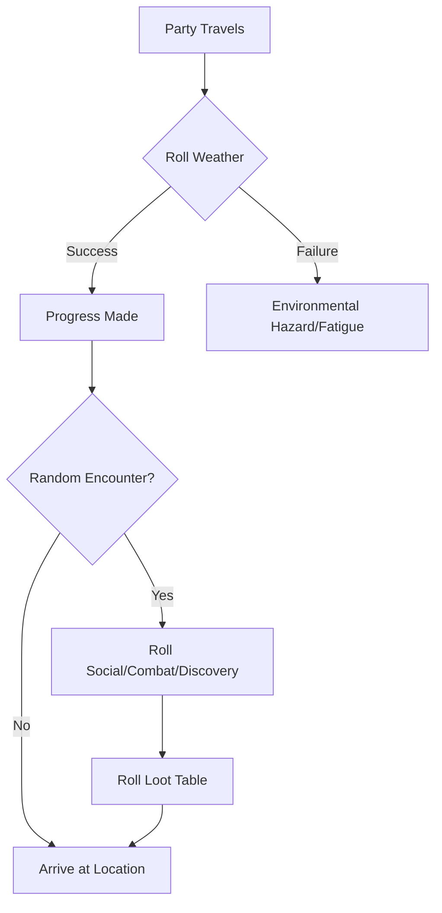

# Plan: World of Eda (GM Guide)

This plan outlines the creation of a comprehensive Game Master-specific book for the Eda TTRPG.

## 1. Document Structure
The book will be structured to provide quick reference for mechanics first, followed by deep lore.

- **Part I: GM Toolkit (The "First" Priority)**
    - **Weather Systems**: Regional tables for the Long Winter and other climates.
    - **Travel & Survival**: Rules for fatigue, navigation, and wilderness hazards.
    - **Random Tables**: Loot (Common to Artifact), Random Encounters (Social, Combat, Discovery), and Rumor Generators.
- **Part II: The World of Eda**
    - **Cosmology & Origins**: The truth behind the "Old Night" and the meaning of "Eda".
    - **Religions**: Detailed pantheons, secret cults, and the "Madness of the Faithful".
    - **Factions**: Political agendas of the Iron Covenant, Ashen Seers, and others.
- **Part III: Gazetteer**
    - **Detailed Regions**: Beyond the Fjordlands.
    - **Points of Interest**: Dungeons, ruins, and cities with GM-only secrets.

## 2. Proposed Workflow

### Phase 1: Foundation & Mechanics
- [ ] Initialize `World_of_Eda.md` with the Table of Contents.
- [ ] Create the **Weather Table** (d100) integrated with the DoS system (e.g., Extreme weather requires higher DoS to resist effects).
- [ ] Establish **Travel Rules** (Distance per day, Fatigue checks).
- [ ] Design **Loot Tables** categorized by "Quality" and "Rarity".

### Phase 2: Lore & Factions
- [ ] Expand on the three desperate states mentioned in *The Age of Wolves*:
    - **Iron Covenant** (Tyranny)
    - **Ashen Seers** (Madness)
    - **The Hollowed** (Silence)
- [ ] Define the hidden religions and their actual supernatural patrons.

### Phase 3: Locations & Secrets
- [ ] Map out 3-5 major regions and their key tension points.
- [ ] Add "GM Eyes Only" sidebars for existing locations (like Oakhaven) to reveal what's really happening.

## 3. Mermaid Diagram: GM Decision Loop

## 4. Next Steps
Once the plan is approved, I will switch to **Code Mode** to begin implementing the toolkit sections in `World_of_Eda.md`.
